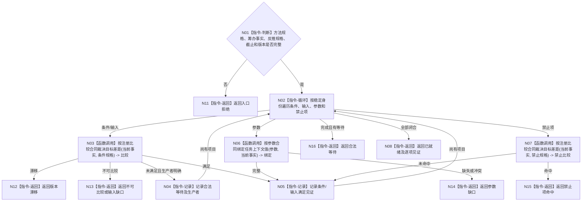

# BIZ-L4-004-03-05-02 比较方法条件输入参数禁止项与当前事实目标函数流程图 v0.1

更新时间：2026-08-03

## 依据

```text
4190、4130、5230、5250、5300；BIZ-L3-004-03-05
```

## 身份与边界

正式目标函数设计图。用登记的比较合同逐项复核方法条件、输入、参数和禁止项，形成就绪、等待或具名缺口；不执行动作。

## 函数合同

```text
根函数：方法候选复判服务::比较方法条件输入参数禁止项与当前事实
归属模块 / 文件 / 层级：方法候选复判 / 海中鱼巣/领域/服务.方法候选复判.ixx / L4
现有或待新增：待新增；组合特征判断收束和参数绑定规则
完整签名：方法前置事实比较结果 方法候选复判服务::比较方法条件输入参数禁止项与当前事实(const 方法前置事实比较请求& 请求) const
参数：请求为只读借用；含方法完整执行规格、任务筹办一致事实、目标反推规格、事实截止和条件/参数/禁止项规则版本
返回结果：不可变值式结果；含已就绪、合法等待、参数缺口、输入缺口、禁止项命中、不可比较、版本漂移或内部不一致，以及逐项比较和合法生产者
被调函数流程图：目标比较复用BIZ-L3-004-01-02；参数绑定和等待生产者定位在L5展开
父图：BIZ-L3-004-03-05
```

## 流程图



## 节点合同

| 节点 | 类型 | 参数 / 输入绑定 | 结果 / 输出绑定 | 事实读写 | 后继条件 | 验证 |
| --- | --- | --- | --- | --- | --- | --- |
| N02 | 指令-循环 | 稳定规格组 | 当前项目 | 无写入 | 每项一次 | 不跳过禁止项 |
| N03/N06/N07 | 函数调用 | 当前事实与规格 | 比较或绑定 | 只读事实 | 登记合同有效 | 不统一减法、不默认值 |
| N04/N05/N08/N11—N16 | 指令 / 返回 | 逐项裁决 | 就绪/等待/缺口 | 无写入 | 全部闭合才就绪 | 等待生产者具名 |

## 关键边界

条件未满足且有合法生产者是等待，不是方法失败；结构或参数在筹办前就缺失则是具名能力缺口，不能拖到执行期补造。
