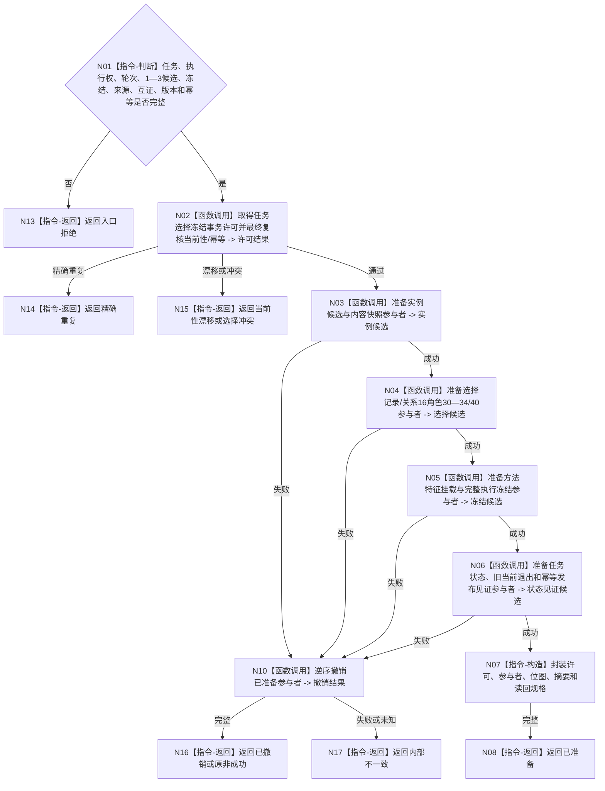

# BIZ-L4-004-03-06-01 准备任务方法选择冻结事务候选目标函数流程图 v0.1

更新时间：2026-08-03

## 依据

```text
3200、4010—4050、5200、5210、5230、5300；BIZ-L3-004-03-06
```

## 身份与边界

正式目标函数设计图。在任务事务独占许可内准备1—3实例候选、选择记录、关系16、方法特征挂载、执行冻结和幂等见证；不发布。

## 函数合同

```text
根函数：任务方法选择冻结数据操作::准备事务候选
归属模块 / 文件 / 层级：任务方法选择冻结数据操作 / 海中鱼巣/领域/数据操作.任务方法选择冻结.ixx / L4
现有或待新增：待新增；组合实例、选择、关系、挂载、冻结和值见证参与者
完整签名：任务方法选择冻结候选准备结果 任务方法选择冻结数据操作::准备事务候选(const 任务方法选择冻结候选准备请求& 请求)
参数：请求为只读借用；含任务、筹办执行权/轮次、有序1—3候选、首候选、完整冻结、全部来源与权限、关系14/23事实、版本、幂等身份组和语义摘要
返回结果：移动结果；含已准备、精确重复、选择冲突、当前性漂移、幂等冲突、资源失败、已撤销或内部不一致；成功时唯一携带事务候选
被调函数流程图：六类参与者准备和局部逆序撤销在L5展开
父图：BIZ-L3-004-03-06
```

## 流程图



## 节点合同

| 节点 | 类型 | 参数 / 输入绑定 | 结果 / 输出绑定 | 事实读写 | 后继条件 | 验证 |
| --- | --- | --- | --- | --- | --- | --- |
| N02 | 函数调用 | 完整请求 | 独占许可 | 无发布 | 当前性通过 | 同任务同轮唯一 |
| N03—N06 | 函数调用 | 六类写集 | 不可见候选 | 仅未发布候选 | 全准备或撤销 | 关系16和14/23互证 |
| N07/N08 | 构造 / 返回 | 许可和候选 | 唯一移动事务候选 | 无发布 | 所有权移交 | 不泄漏参与者控制权 |
| N10/N13—N17 | 撤销 / 返回 | 部分候选 | 结构化结果 | 清除候选 | 完整撤销 | 未知不得普通失败 |

## 关键边界

候选准备不建立筹办回执，也不开始方法动作；执行冻结必须完整绑定任务、轮次、方法内容、动作入口、条件、输入、来源、权限和失效条件。
