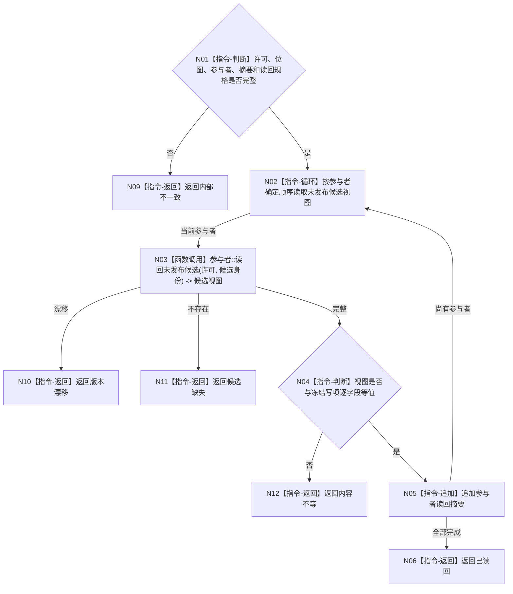

# BIZ-L4-004-03-06-02 读回全部未发布选择冻结参与者候选目标函数流程图 v0.1

更新时间：2026-08-03

## 依据

```text
4010—4050、5230；BIZ-L3-004-03-06；BIZ-L4-004-03-06-01
```

## 身份与边界

正式目标函数设计图。在同一事务许可内读回全部未发布候选并与冻结请求逐项互证；不确认、不发布。

## 函数合同

```text
根函数：任务方法选择冻结数据操作::读回全部未发布参与者候选
归属模块 / 文件 / 层级：任务方法选择冻结数据操作 / 海中鱼巣/领域/数据操作.任务方法选择冻结.ixx / L4
现有或待新增：待新增
完整签名：任务方法选择冻结候选读回结果 任务方法选择冻结数据操作::读回全部未发布参与者候选(const 任务方法选择冻结事务候选& 候选) const
参数：候选为只读借用且保持唯一外部所有权；含许可、参与者、位图、摘要和冻结读回规格
返回结果：不可变值式结果；含已读回、候选缺失、内容不等、版本漂移或内部不一致，以及逐参与者读回摘要
被调函数流程图：各参与者同许可候选视图读取在L5展开
父图：BIZ-L3-004-03-06
```

## 流程图



## 节点合同

| 节点 | 类型 | 参数 / 输入绑定 | 结果 / 输出绑定 | 事实读写 | 后继条件 | 验证 |
| --- | --- | --- | --- | --- | --- | --- |
| N02/N03 | 循环 / 函数调用 | 同许可候选 | 参与者视图 | 只读未发布候选 | 每项一次 | 不读取已发布最新值替代 |
| N04—N06 | 指令 | 视图和冻结写项 | 联合摘要 | 无写入 | 逐字段等值 | 全来源/角色集合比较 |
| N09—N12 | 指令-返回 | 非成功 | 结构化结果 | 无写入 | 返回父图 | 缺失与不等分离 |

## 关键边界

候选读回通过仍不构成事实发布；任何一个参与者缺失或不等都必须撤销整个候选。
