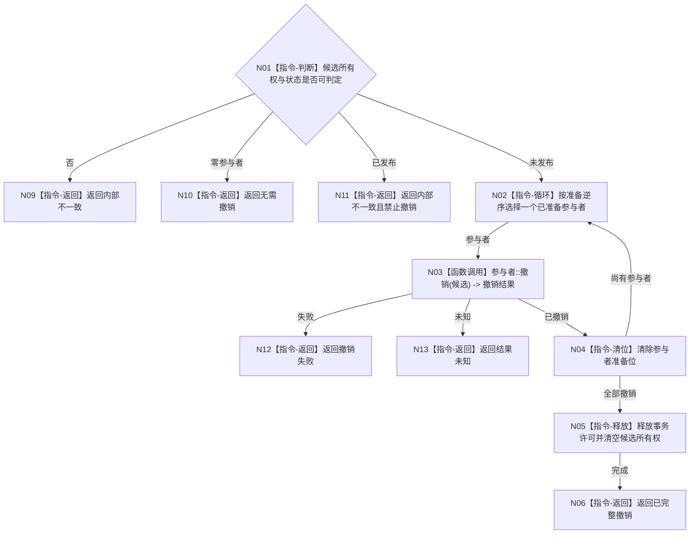

# BIZ-L4-004-03-06-03 逆序撤销任务方法选择冻结事务目标函数流程图 v0.1

更新时间：2026-08-03

## 依据

```text
4010—4050、5230；BIZ-L3-004-03-06
```

## 身份与边界

正式目标函数设计图。只撤销尚未发布的任务方法选择冻结事务候选，按准备逆序清除参与者并释放许可。

## 函数合同

```text
根函数：任务方法选择冻结数据操作::逆序撤销事务
归属模块 / 文件 / 层级：任务方法选择冻结数据操作 / 海中鱼巣/领域/数据操作.任务方法选择冻结.ixx / L4
现有或待新增：待新增
完整签名：任务方法选择冻结撤销结果 任务方法选择冻结数据操作::逆序撤销事务(任务方法选择冻结事务候选&& 候选) noexcept
参数：候选为唯一移动所有权；必须仍处于未发布状态
返回结果：不可变值式结果；含已完整撤销、无需撤销、撤销失败、结果未知或内部不一致，以及逐参与者撤销状态
被调函数流程图：参与者撤销为通用事务能力
父图：BIZ-L3-004-03-06；BIZ-L4-004-03-06-01/04
```

## 流程图



## 节点合同

| 节点 | 类型 | 参数 / 输入绑定 | 结果 / 输出绑定 | 事实读写 | 后继条件 | 验证 |
| --- | --- | --- | --- | --- | --- | --- |
| N02—N04 | 循环 / 函数调用 | 未发布候选 | 撤销状态 | 清除候选 | 逆序完整 | 每准备点故障注入 |
| N05/N06 | 指令 | 空候选 | 完成结果 | 释放许可 | 全位清除 | 候选不可再用 |
| N09—N13 | 指令-返回 | 异常状态 | 结构化结果 | 不掩盖残留 | 返回隔离 | 已发布禁止撤销 |

## 关键边界

撤销失败或未知不能降级为普通业务拒绝；必须保留隔离材料，防止同任务同轮再次准备造成双候选。
