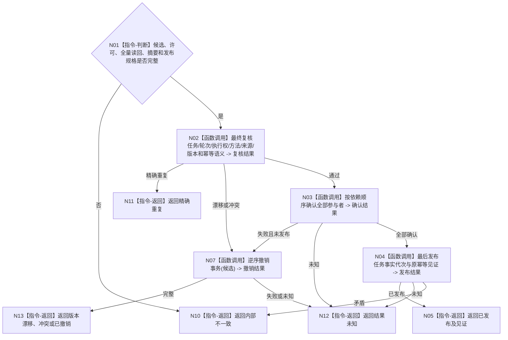

# BIZ-L4-004-03-06-04 确认并原子发布任务方法选择冻结事务目标函数流程图 v0.1

更新时间：2026-08-03

## 依据

```text
4010—4050、5200、5210、5230；BIZ-L3-004-03-06
```

## 身份与边界

正式目标函数设计图。确认全部参与者后最后切换一个任务事实代次，使实例候选、当前选择、挂载、状态和执行冻结同时可见。

## 函数合同

```text
根函数：任务方法选择冻结数据操作::确认并原子发布事务
归属模块 / 文件 / 层级：任务方法选择冻结数据操作 / 海中鱼巣/领域/数据操作.任务方法选择冻结.ixx / L4
现有或待新增：待新增
完整签名：任务方法选择冻结确认发布结果 任务方法选择冻结数据操作::确认并原子发布事务(任务方法选择冻结事务候选&& 候选)
参数：候选为唯一移动所有权；含已读回一致的全部参与者、许可、摘要、幂等身份和发布规格
返回结果：不可变值式结果；含已发布、精确重复、版本漂移、幂等冲突、已撤销、结果未知或内部不一致，以及发布版本和见证
被调函数流程图：复用BIZ-L4-004-03-06-03撤销；参与者确认和最后发布在L5展开
父图：BIZ-L3-004-03-06
```

## 流程图



## 节点合同

| 节点 | 类型 | 参数 / 输入绑定 | 结果 / 输出绑定 | 事实读写 | 后继条件 | 验证 |
| --- | --- | --- | --- | --- | --- | --- |
| N02 | 函数调用 | 候选和当前事实 | 最终复核 | 无发布 | 同轮同义 | 提交前最后复核 |
| N03/N04 | 函数调用 | 全部参与者 | 确认与发布 | 最后切换任务事实代次 | 全确认后发布 | 无半冻结可见 |
| N07 | 函数调用 | 未发布候选 | 撤销 | 清除候选 | 未发布才允许 | 复用专用撤销合同 |
| N05/N10—N13 | 指令-返回 | 发布裁决 | 结构化结果 | 无额外写入 | 返回父图 | 未知禁止重放 |

## 关键边界

发布成功只形成本轮选择与执行冻结，不开始方法运行；执行前仍须重新复核冻结当前性和治理许可。

