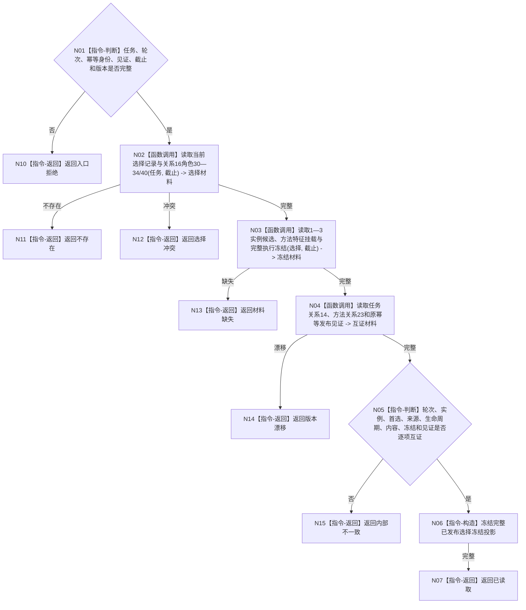

# BIZ-L4-004-03-06-05 联合读回已发布选择实例与执行冻结目标函数流程图 v0.1

更新时间：2026-08-03

## 依据

```text
3200、5200、5210、5230；BIZ-L3-004-03-06
```

## 身份与边界

正式目标函数设计图。按发布版本联合读回当前选择、1—3实例候选、方法特征挂载、完整执行冻结和关系14/23/16互证。

## 函数合同

```text
根函数：任务方法选择冻结数据操作::联合读回已发布选择与冻结
归属模块 / 文件 / 层级：任务方法选择冻结数据操作 / 海中鱼巣/领域/数据操作.任务方法选择冻结.ixx / L4
现有或待新增：待新增
完整签名：任务方法选择冻结联合读回结果 任务方法选择冻结数据操作::联合读回已发布选择与冻结(const 任务方法选择冻结联合读回请求& 请求) const
参数：请求为只读借用；含任务、筹办轮次、原幂等身份、发布见证、事实截止和任务/方法/冻结规则版本
返回结果：不可变值式结果；含已读取、不存在、材料缺失、选择冲突、版本漂移或内部不一致，以及完整已发布选择冻结投影
被调函数流程图：选择记录、关系16、实例、挂载、冻结和关系14/23专用读取在L5展开
父图：BIZ-L3-004-03-06
```

## 流程图



## 节点合同

| 节点 | 类型 | 参数 / 输入绑定 | 结果 / 输出绑定 | 事实读写 | 后继条件 | 验证 |
| --- | --- | --- | --- | --- | --- | --- |
| N02—N04 | 函数调用 | 任务、轮次、截止和见证 | 选择、冻结和互证材料 | 只读已发布事实 | 同一发布见证 | 关系16角色全集 |
| N05—N07 | 指令 | 全量材料 | 完整投影 | 无写入 | 逐项互证 | 1—3实例且首选属于集合 |
| N10—N15 | 指令-返回 | 非成功 | 结构化结果 | 无写入 | 返回父图 | 缺失、冲突、漂移分账 |

## 关键边界

不得从选择记录单独推断执行冻结，也不得从执行冻结反向补方法生命周期或来源需求；全部材料必须绑定同一筹办轮次和发布见证。

