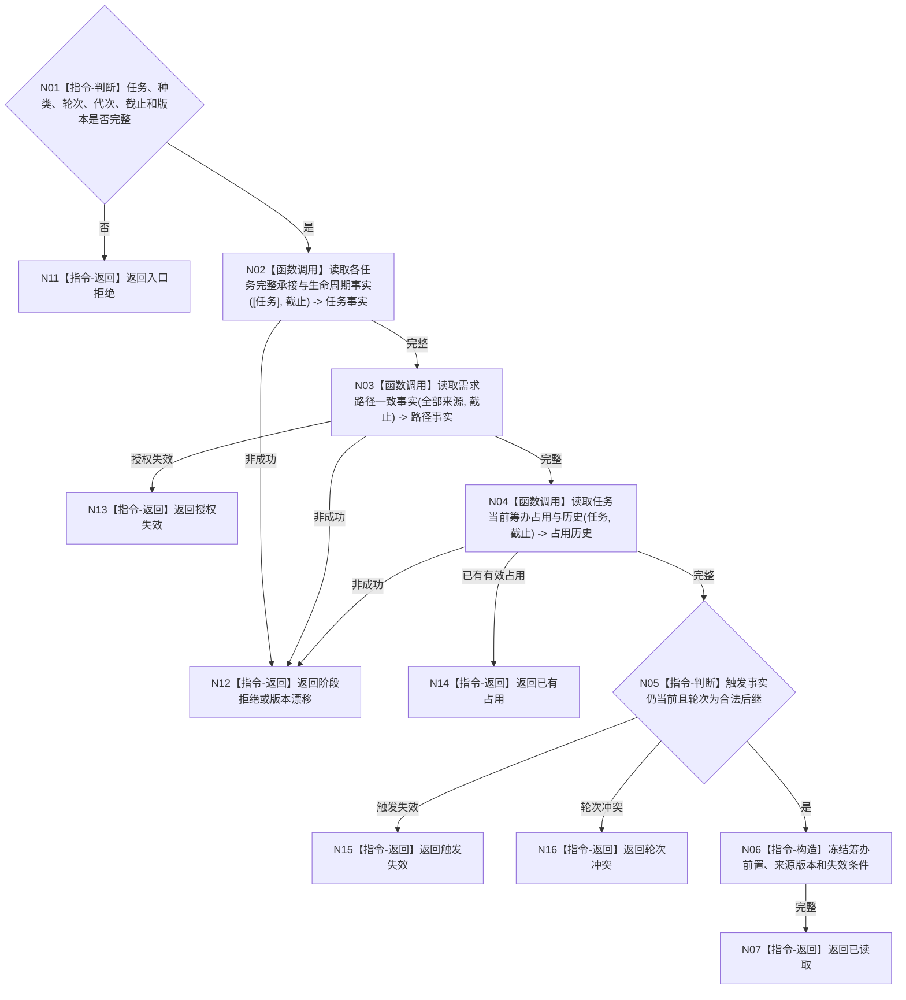

# BIZ-L4-004-04-01-01 读取筹办工作冻结前置目标函数流程图 v0.1

更新时间：2026-08-03

## 依据

```text
3200、5090、5210、5230、8100；BIZ-L3-004-04-01
```

## 身份与边界

正式目标函数设计图。读取筹办或重筹办工作包所需的任务、触发、轮次、来源授权、活动路径和当前占用前置；不取得筹办执行权。

## 函数合同

```text
根函数：任务工作冻结事实提供者::读取筹办工作冻结前置
归属模块 / 文件 / 层级：任务工作冻结事实提供者 / 海中鱼巣/领域/提供者.任务工作冻结事实.ixx / L4
现有或待新增：待新增；组合任务、需求路径和筹办占用读取
完整签名：筹办工作冻结前置读取结果 任务工作冻结事实提供者::读取筹办工作冻结前置(const 筹办工作冻结前置读取请求& 请求) const
参数：请求为只读借用；含任务、工作种类、期望筹办轮次、运行代次、事实截止、任务/需求/筹办规则版本
返回结果：不可变值式结果；含已读取、阶段拒绝、触发失效、轮次冲突、授权失效、已有占用、版本漂移或内部不一致，以及完整筹办前置和失效条件
被调函数流程图：任务承接/生命周期复用BIZ-L4-004-02-02-02；需求路径复用BIZ-L4-002-06-02-01—03；占用历史复用BIZ-L4-004-03-01-01
父图：BIZ-L3-004-04-01
```

## 流程图



## 节点合同

| 节点 | 类型 | 参数 / 输入绑定 | 结果 / 输出绑定 | 事实读写 | 后继条件 | 验证 |
| --- | --- | --- | --- | --- | --- | --- |
| N02—N04 | 函数调用 | 任务和固定截止 | 任务、路径、占用事实 | 只读正式事实 | 同截止完整 | 全来源保留 |
| N05—N07 | 指令 | 三组事实 | 筹办前置 | 无写入 | 触发当前、轮次合法 | 不取得执行权 |
| N11—N16 | 指令-返回 | 非成功 | 结构化结果 | 无写入 | 返回父图 | 冲突与漂移分离 |

## 关键边界

筹办工作包只授权工作线程进入“取得筹办执行权”流程；它本身不携带动作许可、方法实例或已经取得的筹办执行权。
