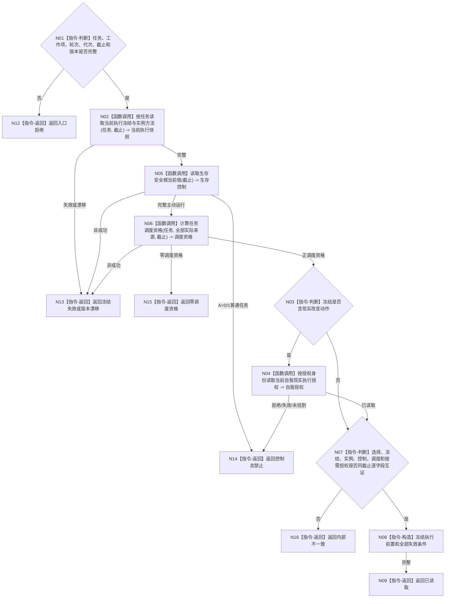

# BIZ-L4-004-04-01-02 读取执行工作冻结前置目标函数流程图 v0.1

更新时间：2026-08-03

## 依据

```text
3200、5090、5210、5230、6170、8100；BIZ-L3-004-04-01
```

## 身份与边界

正式目标函数设计图。读取执行工作包所需的任务当前选择、实例方法、完整执行冻结、生存控制和逐来源调度资格；冻结含现实改变时再按身份读取唯一自我现实执行授权。函数不读取旧许可账，不消费通用令牌。

## 函数合同

```text
根函数：任务工作冻结事实提供者::读取执行工作冻结前置
归属模块 / 文件 / 层级：任务工作冻结事实提供者 / 海中鱼巣/领域/提供者.任务工作冻结事实.ixx / L4
现有或待新增：待新增；组合已发布任务当前选择 / 冻结 / 实例、生存控制、调度资格和按需自我授权读取
完整签名：执行工作冻结前置读取结果 任务工作冻结事实提供者::读取执行工作冻结前置(const 执行工作冻结前置读取请求& 请求) const
参数：请求为只读借用；含任务、工作项身份、任务 / 筹办 / 执行轮次、运行代次、事实截止、选择 / 生存 / 调度 / 自我授权规则版本和按需授权身份
返回结果：不可变值式结果；含已读取、控制态禁止、零调度资格、授权拒绝、冻结失效、当前性漂移、版本漂移或内部不一致，以及选择、实例、冻结、控制态、调度资格、按需自我授权和失效条件
被调函数流程图：选择 / 冻结 / 实例复用BIZ-L4-002-05-02-02 v0.2；生存根复用BIZ-L4-002-05-01-01 v0.2；调度资格复用BIZ-L3-003-03-03；现实改变授权复用BIZ-L2-002-10 v0.2正式读回
父图：BIZ-L3-004-04-01
```

## 流程图



## 节点合同

| 节点 | 类型 | 参数 / 输入绑定 | 结果 / 输出绑定 | 事实读写 | 后继条件 | 验证 |
| --- | --- | --- | --- | --- | --- | --- |
| N02—N06 | 函数调用 | 任务、冻结、授权身份和截止 | 选择、冻结、实例、控制、调度和按需自我授权 | 只读正式事实 | 同截止完整 | 内部治理 / 纯观察零授权；现实改变一份授权 |
| N07—N09 | 指令 | 全部正式读回 | 执行前置 | 无写入 | 逐项互证 | 全来源调度材料保留 |
| N12—N16 | 指令-返回 | 非成功 | 结构化结果 | 无写入 | 返回父图 | 零调度资格不是未授权或任务失败 |

## 关键边界

冻结工作包不消费旧通用执行令牌；真正动作开始前仍须 fresh 复核当前冻结、生存控制、调度资格、按需自我授权、具体技术许可和安全硬否决。零调度资格保留任务和排队历史，但不得正常派发执行包。
