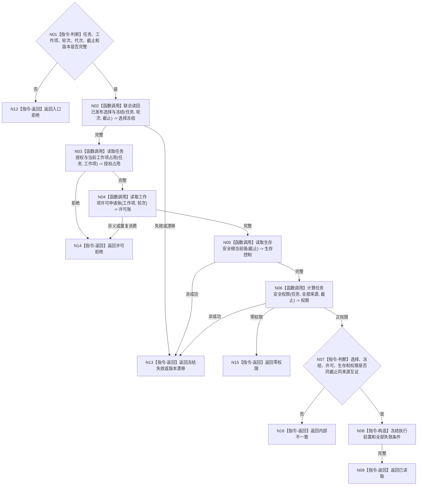

# BIZ-L4-004-04-01-02 读取执行工作冻结前置目标函数流程图 v0.1

更新时间：2026-08-03

## 依据

```text
3200、5090、5210、5230、6170、8100；BIZ-L3-004-04-01
```

## 身份与边界

正式目标函数设计图。读取执行工作包所需的任务当前选择、实例方法、完整执行冻结、一次性许可、生存控制和逐来源权限；不消费许可。

## 函数合同

```text
根函数：任务工作冻结事实提供者::读取执行工作冻结前置
归属模块 / 文件 / 层级：任务工作冻结事实提供者 / 海中鱼巣/领域/提供者.任务工作冻结事实.ixx / L4
现有或待新增：待新增；组合选择冻结、许可、生存和权限读取
完整签名：执行工作冻结前置读取结果 任务工作冻结事实提供者::读取执行工作冻结前置(const 执行工作冻结前置读取请求& 请求) const
参数：请求为只读借用；含任务、工作项身份、筹办轮次、运行代次、事实截止、选择/许可/权限/生存规则版本
返回结果：不可变值式结果；含已读取、许可拒绝、零权限、冻结失效、当前性漂移、版本漂移或内部不一致，以及选择、实例、冻结、许可、权限和失效条件
被调函数流程图：选择冻结复用BIZ-L4-004-03-06-05；许可复用BIZ-L4-002-05-02-01—03；生存根复用BIZ-L4-002-05-01-01；权限复用BIZ-L3-003-03-03
父图：BIZ-L3-004-04-01
```

## 流程图



## 节点合同

| 节点 | 类型 | 参数 / 输入绑定 | 结果 / 输出绑定 | 事实读写 | 后继条件 | 验证 |
| --- | --- | --- | --- | --- | --- | --- |
| N02—N06 | 函数调用 | 任务、工作项和截止 | 选择、许可、生存和权限 | 只读正式事实 | 同截止完整 | 许可尚未消费 |
| N07—N09 | 指令 | 五组事实 | 执行前置 | 无写入 | 逐项互证 | 全来源权限保留 |
| N12—N16 | 指令-返回 | 非成功 | 结构化结果 | 无写入 | 返回父图 | 零权限不是任务失败 |

## 关键边界

冻结工作包不消费一次性许可；真正动作开始前仍须由执行入口再次复核并原子消费许可。零权限保留任务和排队历史，但不得正常派发执行包。

