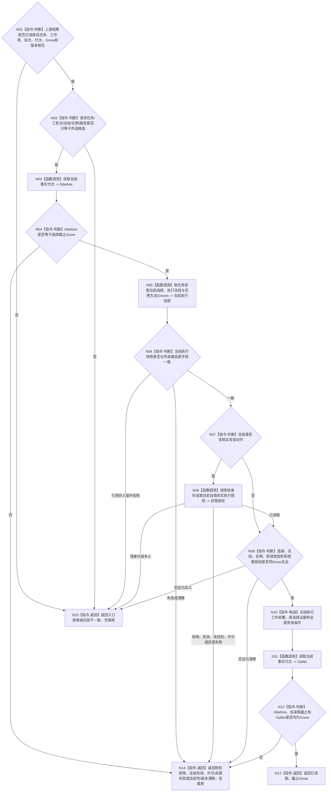

# BIZ-L4-004-04-01-02 读取执行工作冻结前置目标函数流程图 v0.2

更新时间：2026-08-27

## 依据与替代

```text
3200、5090、5210、5230、6150、6170、8100；BIZ-L2-003-03 v0.4、BIZ-L3-004-04-01
```

本图替代 v0.1 中再次调用旧 `BIZ-L3-003-03-03` 计算单任务权限的路径。执行工作包只能由刚完成的003-03完整选择结果形成；本函数复核该结果与当前冻结仍同义，不建立第二调度入口或重算另一份候选投影。

## 身份与边界

正式目标函数设计图。读取执行工作包所需的当前选择、实例方法和完整执行冻结，逐字段互证上游003-03所选候选、调度投影与 `Gnow`；冻结含现实改变时再按显式身份读取唯一自我现实执行授权。它不读取旧许可账、不消费通用令牌，也不从任务句柄重新选择任务。

## 函数合同

```text
根函数：任务工作冻结事实提供者::读取执行工作冻结前置
归属模块 / 文件 / 目标分解深度：任务工作冻结事实提供者 / 海中鱼巣/领域/提供者.任务工作冻结事实.ixx / BIZ-L4
现有或待新增：待新增；复用任务当前选择/冻结/实例、自我授权和当前事实代次读取
完整签名：执行工作冻结前置读取结果 任务工作冻结事实提供者::读取执行工作冻结前置(const 执行工作冻结前置读取请求& 请求) const noexcept
参数：请求只读借用；含BIZ-L2-003-03状态为已选择的完整结果、工作项身份、运行代次、选择截止Gnow、按需自我授权身份和工作冻结规则版本；任务、三轮次、冻结、实例、路径及调度投影只能来自该选择结果
返回结果：已读取、授权拒绝、冻结失效、当前性漂移、版本漂移、入口拒绝、许可拒绝、资源失败或内部不一致；成功含当前选择/实例/冻结、原完整调度投影、按需授权、失效条件和截止Gnow
被调函数流程图：选择/冻结/实例复用BIZ-L4-002-05-02-02 v0.2；现实改变授权复用BIZ-L2-002-10 v0.2正式读回；调度材料只消费BIZ-L2-003-03 v0.4已选择结果
父图：BIZ-L3-004-04-01
```

## 流程图



## 节点合同

| 节点 | 类型 | 输入绑定 | 输出绑定 | 事实读写 | 验证 |
| --- | --- | --- | --- | --- | --- |
| N01/N02 | 入口互证 | 003-03已选择结果、工作项请求 | 唯一所选候选 | 无写入 | 非已选择、换任务/轮次/冻结、调用方补字段 |
| N05/N06 | 正式读取 / 互证 | 所选T、Gnow | 当前选择、冻结、实例 | 只读task owner | 冻结失效、实例变化、错路径、混轮次 |
| N07—N10 | 判断 / 授权读取 / 构造 | 当前冻结、原调度投影、授权身份 | 执行工作前置 | 只读自我授权owner；无业务写入 | 内部治理/纯观察零授权；现实改变一份授权 |
| N03/N11/N12 | 读取 / 守卫 | Gnow | 同截止证明 | 只读当前事实代次 | 选择后到工作包冻结前漂移 |

## 关键边界

- `控制态禁止`和`零调度资格`不能进入本函数；它们已由003-03返回空选择，调用本函数属于入口错误。
- 本函数不得重新调用单任务权限、重新枚举候选或选择另一任务；调度唯一来源是上游003-03完整已选择结果。
- 成功只冻结不可变工作材料，不发布任务排队事实；真正动作开始前仍须 fresh 复核当前冻结、调度资格、按需自我授权、技术许可和安全硬否决。
