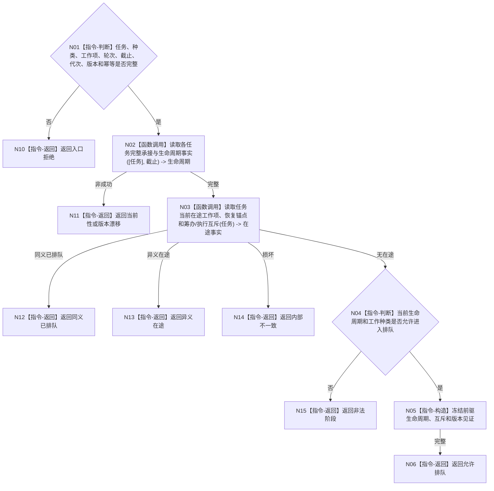

# BIZ-L4-004-04-03-01 读取任务排队前置事实目标函数流程图 v0.1

更新时间：2026-08-03

## 依据

```text
3200、5210、5230；BIZ-L3-004-04-03
```

## 身份与边界

正式目标函数设计图。读取任务当前生命周期、唯一在途工作项、筹办/执行互斥和原幂等排队事实；不修改阶段。

## 函数合同

```text
根函数：任务排队数据操作::读取任务排队前置事实
归属模块 / 文件 / 层级：任务排队数据操作 / 海中鱼巣/领域/数据操作.任务排队.ixx / L4
现有或待新增：待新增；组合任务生命周期和工作项锚点读取
完整签名：任务排队前置事实读取结果 任务排队数据操作::读取任务排队前置事实(const 任务排队前置事实读取请求& 请求) const
参数：请求为只读借用；含任务、工作种类、工作项身份、筹办轮次、事实截止、运行代次、期望任务版本和幂等身份
返回结果：不可变值式结果；含允许排队、同义已排队、非法阶段、异义在途、当前性漂移、版本漂移或内部不一致，以及生命周期、在途项和互斥见证
被调函数流程图：任务生命周期复用BIZ-L4-004-02-02-02；工作项锚点和互斥专用读取在L5展开
父图：BIZ-L3-004-04-03
```

## 流程图



## 节点合同

| 节点 | 类型 | 参数 / 输入绑定 | 结果 / 输出绑定 | 事实读写 | 后继条件 | 验证 |
| --- | --- | --- | --- | --- | --- | --- |
| N02/N03 | 函数调用 | 任务和截止 | 生命周期与在途事实 | 只读任务事实 | 同截止完整 | 同任务唯一在途 |
| N04—N06 | 指令 | 前置事实 | 排队资格 | 无写入 | 阶段合法 | 筹办/执行互斥 |
| N10—N15 | 指令-返回 | 非成功 | 结构化结果 | 无写入 | 返回父图 | 同义与异义分离 |

## 关键边界

排队前置读取不查看物理队列槽位；任务领域排队事实和线程队列发布是两个有序阶段，由恢复锚点跨越中间窗口。
