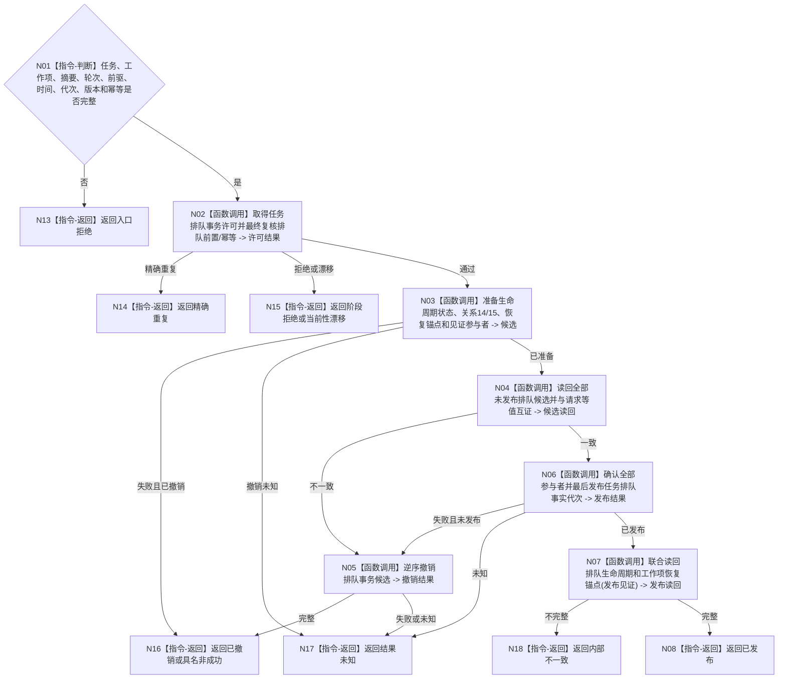

# BIZ-L4-004-04-03-02 发布排队事实与恢复锚点事务目标函数流程图 v0.1

更新时间：2026-08-03

## 依据

```text
3200、4010—4050、5210、5230；BIZ-L3-004-04-03
```

## 身份与边界

正式目标函数设计图。把新排队生命周期、迁移证据、工作项恢复锚点、旧当前退出和发布见证作为一个任务领域事务发布。

## 函数合同

```text
根函数：任务排队数据操作::发布排队事实与恢复锚点事务
归属模块 / 文件 / 层级：任务排队数据操作 / 海中鱼巣/领域/数据操作.任务排队.ixx / L4
现有或待新增：待新增；组合状态、关系14/15、恢复锚点和值见证参与者
完整签名：任务排队事务发布结果 任务排队数据操作::发布排队事实与恢复锚点事务(const 任务排队事务发布请求& 请求)
参数：请求为只读借用；含任务、工作种类/身份、冻结摘要、筹办轮次、前驱生命周期、发生时间、运行代次、期望版本、幂等身份和语义摘要
返回结果：不可变值式结果；含已发布、精确重复、阶段拒绝、当前性漂移、幂等冲突、已撤销、结果未知或内部不一致，以及排队生命周期、恢复锚点和发布见证
被调函数流程图：参与者准备、未发布读回、逆序撤销、确认和联合读回在L5展开
父图：BIZ-L3-004-04-03
```

## 流程图



## 节点合同

| 节点 | 类型 | 参数 / 输入绑定 | 结果 / 输出绑定 | 事实读写 | 后继条件 | 验证 |
| --- | --- | --- | --- | --- | --- | --- |
| N02 | 函数调用 | 完整请求 | 事务许可 | 无发布 | 前置仍当前 | 同任务唯一在途 |
| N03/N04 | 函数调用 | 完整写集 | 不可见候选与读回 | 仅未发布候选 | 全部等值 | 锚点足以重建同一包 |
| N05/N06 | 函数调用 | 候选 | 撤销或发布 | 最后切换任务事实代次 | 全确认后发布 | 无半排队事实 |
| N07/N08/N13—N18 | 调用 / 返回 | 发布状态 | 联合读回或非成功 | 只读已发布事实 | 返回父图 | 未知禁止重放 |

## 关键边界

恢复锚点只保存重建同一不可变工作包所需的值式材料，不保存队列地址、槽位、锁或候选令牌。排队发布不证明队列确认。

