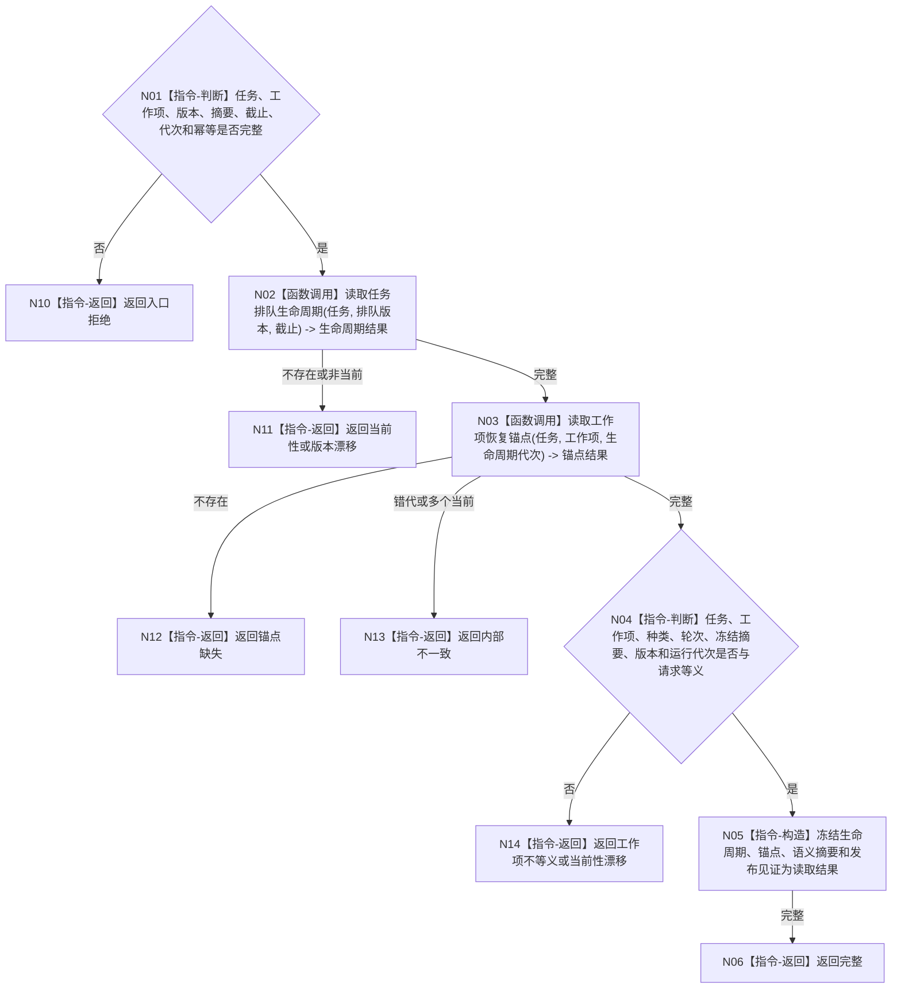

# BIZ-L4-004-04-06-01 读取任务排队事实与恢复锚点目标函数流程图 v0.1

更新时间：2026-08-03

## 依据

```text
3200、4050、5210、5230；BIZ-L3-004-04-06
```

## 身份与边界

正式目标函数设计图。按任务、工作项和排队发布版本读取同一任务事实代次中的排队生命周期、冻结摘要和恢复锚点；不读取线程队列，不从日志恢复事实。

## 函数合同

```text
根函数：任务排队数据操作::读取任务排队事实与恢复锚点
归属模块 / 文件 / 层级：任务排队数据操作 / 海中鱼巣/领域/数据操作.任务排队.ixx / L4
现有或待新增：待新增；组合任务排队生命周期、工作项锚点和发布见证读取
完整签名：任务排队锚点读取结果 任务排队数据操作::读取任务排队事实与恢复锚点(const 任务排队锚点读取请求& 请求) const
参数：请求为只读借用；含任务、工作项身份、排队发布版本、冻结摘要、事实截止、运行代次和协调幂等身份
返回结果：不可变值式结果；含完整、当前性漂移、版本漂移、工作项不等义、锚点缺失或内部不一致，以及排队生命周期、恢复锚点、语义摘要和发布见证
被调函数流程图：无；具名任务事实读取入口为数据操作内部的简单同代次读取
父图：BIZ-L3-004-04-06
```

## 流程图



## 节点合同

| 节点 | 类型 | 参数 / 输入绑定 | 结果 / 输出绑定 | 事实读写 | 后继条件 | 验证 |
| --- | --- | --- | --- | --- | --- | --- |
| N02/N03 | 函数调用 | 任务、版本、截止和工作项 | 生命周期与恢复锚点 | 只读同一任务事实代次 | 两项均完整 | 不跨代拼接 |
| N04/N05 | 指令 | 请求与已读事实 | 等义见证 | 无写入 | 身份、摘要和版本全等 | 锚点足以重建同一包 |
| N06/N10—N14 | 指令-返回 | 成功或具名非成功 | 结构化结果 | 无写入 | 返回父图 | 缺失、漂移、不等义分离 |

## 关键边界

恢复锚点必须来自排队事实的同一发布代次。SQL行、缓存命中、日志和原候选返回都不能代替本函数的同代次完整读回。

