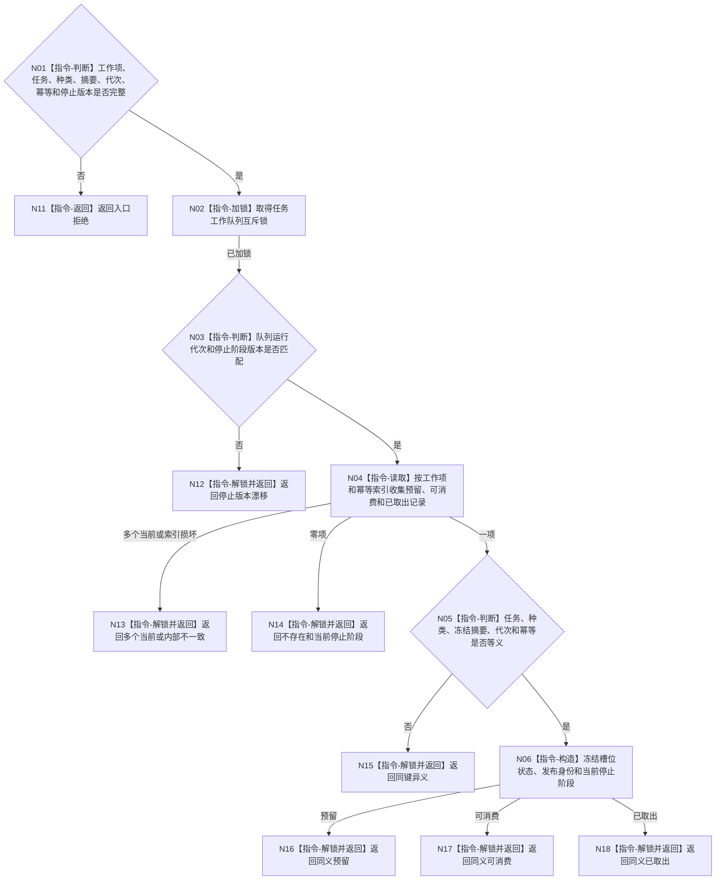

# BIZ-L4-004-04-06-02 查询同工作项状态目标函数流程图 v0.1

更新时间：2026-08-03

## 依据

```text
5090、5230、8100；BIZ-L3-004-04-06
```

## 身份与边界

正式目标函数设计图。在任务工作队列锁内按工作项和幂等身份查询不可见预留、唯一可消费项及停止阶段；不创建、确认或消费工作包。

## 函数合同

```text
根函数：任务工作队列::查询同工作项状态
归属模块 / 文件 / 层级：任务工作队列 / 海中鱼巣/线程/任务工作队列.ixx / L4
现有或待新增：适配扩展；在统一筹办/执行工作队列增加值式状态查询
完整签名：任务工作项状态查询结果 任务工作队列::查询同工作项状态(const 任务工作项状态查询请求& 请求) const
参数：请求为只读借用；含工作项身份、任务、工作种类、冻结摘要、运行代次、发布/协调幂等身份和期望停止阶段版本
返回结果：不可变值式结果；含不存在、同义预留、同义可消费、同义已取出、同键异义、多个当前、停止版本漂移或内部不一致，以及发布身份和当前停止阶段
被调函数流程图：无；锁、幂等索引和槽位扫描均为队列内部指令
父图：BIZ-L3-004-04-06
```

## 流程图



## 节点合同

| 节点 | 类型 | 参数 / 输入绑定 | 结果 / 输出绑定 | 事实读写 | 后继条件 | 验证 |
| --- | --- | --- | --- | --- | --- | --- |
| N02—N04 | 指令 | 查询请求 | 同工作项记录集 | 锁内只读队列 | 0、1或损坏 | 查询不改变可见性 |
| N05/N06 | 指令 | 唯一记录 | 等义状态和发布身份 | 无额外写入 | 完整等义 | 预留/可消费/已取出分账 |
| N11—N18 | 指令-返回 | 查询状态 | 结构化结果 | 解锁后返回 | 返回父图 | 所有路径释放锁 |

## 关键边界

本函数只说明线程队列中的当前材料，不证明任务业务阶段。队列不存在时必须回到任务恢复锚点判断，不得把“不存在”直接解释为任务失败。
