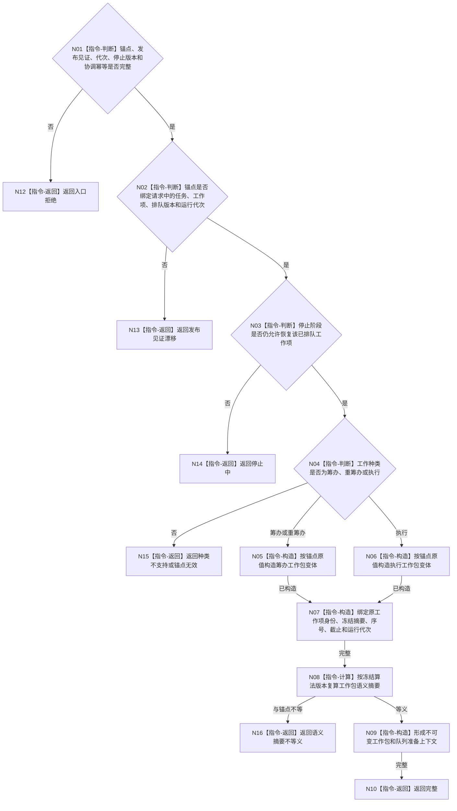

# BIZ-L4-004-04-06-03 按恢复锚点重建同一不可变工作包目标函数流程图 v0.1

更新时间：2026-08-03

## 依据

```text
3200、4050、5090、5210、5230；BIZ-L3-004-04-06
```

## 身份与边界

正式目标函数设计图。仅从已验证的排队恢复锚点确定性重建原筹办、重筹办或执行工作包；不重新选择方法、不重算权限、不读取变化中的当前事实。

## 函数合同

```text
根函数：任务工作恢复服务::按恢复锚点重建同一不可变工作包
归属模块 / 文件 / 层级：任务工作恢复 / 海中鱼巣/领域/服务.任务工作恢复.ixx / L4
现有或待新增：待新增；为排队已发布而队列未公开窗口提供确定性重建
完整签名：任务工作包重建结果 任务工作恢复服务::按恢复锚点重建同一不可变工作包(const 任务工作包重建请求& 请求) const
参数：请求为只读借用；含已验证恢复锚点、任务排队发布见证、当前运行代次、当前停止阶段版本和协调幂等身份
返回结果：不可变值式结果；含完整、锚点无效、种类不支持、发布见证漂移、停止中、语义摘要不等义或内部不一致，以及重建的不可变工作包和准备上下文
被调函数流程图：无；按强类型变体构造和摘要复算均为本函数内确定性指令
父图：BIZ-L3-004-04-06
```

## 流程图



## 节点合同

| 节点 | 类型 | 参数 / 输入绑定 | 结果 / 输出绑定 | 事实读写 | 后继条件 | 验证 |
| --- | --- | --- | --- | --- | --- | --- |
| N02—N04 | 指令 | 锚点和发布见证 | 重建资格 | 无外部读取或写入 | 同任务、同工作项、同代次 | 禁止吸收新当前事实 |
| N05—N07 | 指令 | 锚点原值 | 强类型工作包 | 仅构造值 | 种类合法 | 不重新选择或补默认值 |
| N08—N10 | 指令 | 工作包与锚点摘要 | 等义工作包和准备上下文 | 无写入 | 摘要完全相等 | 确定性重复构造同值 |
| N12—N16 | 指令-返回 | 具名非成功 | 结构化结果 | 无写入 | 返回父图 | 漂移、停止和不等义分离 |

## 关键边界

恢复重建不是重新筹办。任何缺字段、版本变化或摘要不等义都必须停止本次恢复；不得用当前方法、当前权限或当前世界事实修补旧锚点。

