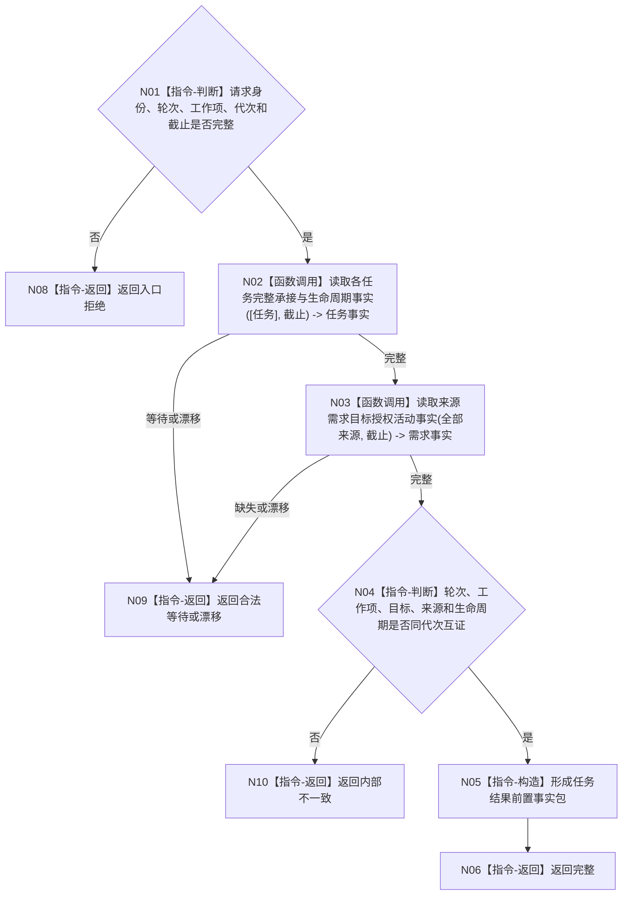

# BIZ-L4-004-05-02-01 读取任务承接目标生命周期与来源需求目标函数流程图 v0.1

更新时间：2026-08-03

## 依据

```text
0050、3200、5090、8100；BIZ-L3-004-05-02
```

## 身份与边界

正式目标函数设计图。按任务、轮次、工作项和事实截止读取同代次任务承接、目标、生命周期及全部来源需求；不读取执行结果。

## 函数合同

```text
根函数：任务结果事实提供者::读取任务承接目标生命周期与来源需求
归属模块 / 文件 / 层级：任务结果事实 / 海中鱼巣/领域/提供者.任务结果事实.ixx / L4
现有或待新增：待新增；组合任务完整承接与需求当前事实读取
完整签名：任务结果前置事实读取结果 任务结果事实提供者::读取任务承接目标生命周期与来源需求(const 任务结果前置事实读取请求& 请求) const
参数：请求为只读借用；含任务、轮次、工作项、来源种类、运行代次和事实截止
返回结果：不可变值式结果；含完整、合法等待、缺失、漂移或内部不一致，以及任务目标、生命周期、工作项和全部来源需求
被调函数流程图：复用BIZ-L4-004-02-02-02和BIZ-L4-004-02-02-03
父图：BIZ-L3-004-05-02
```

## 流程图



## 节点合同

| 节点 | 类型 | 输入 | 输出 | 事实读写 | 验证 |
| --- | --- | --- | --- | --- | --- |
| N02/N03 | 函数调用 | 同一截止请求 | 任务与需求事实 | 只读 | 不跨代拼接 |
| N04—N06 | 指令 | 两类事实 | 前置事实包 | 无写入 | 全来源、单目标、同轮工作项 |

## 关键边界

索引命中和回执自报不替代权威任务、需求读回；筹办完成分支也必须有完整任务目标。
