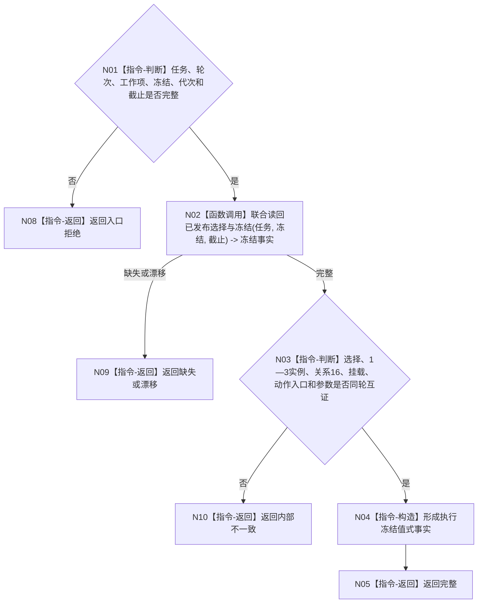

# BIZ-L4-004-05-02-02 读取本轮选择实例与动作入口目标函数流程图 v0.1

更新时间：2026-08-03

## 依据

```text
4050、5090、5300；BIZ-L3-004-05-02
```

## 身份与边界

正式目标函数设计图。按任务、轮次和工作项读取已发布方法选择、实例、冻结与动作入口；不把方法候选或回执自报当作冻结事实。

## 函数合同

```text
根函数：任务执行冻结事实提供者::读取本轮选择实例与动作入口
归属模块 / 文件 / 层级：任务执行冻结事实 / 海中鱼巣/领域/提供者.任务执行冻结事实.ixx / L4
现有或待新增：待新增；组合选择、关系16、实例方法、挂载和动作入口读取
完整签名：任务执行冻结事实读取结果 任务执行冻结事实提供者::读取本轮选择实例与动作入口(const 任务执行冻结事实读取请求& 请求) const
参数：请求为只读借用；含任务、轮次、工作项、冻结身份、运行代次和事实截止
返回结果：不可变值式结果；含完整、缺失、漂移或内部不一致，以及选择、1—3实例、方法登记版本、动作入口、参数和禁止项
被调函数流程图：读取发布后选择与冻结复用BIZ-L4-004-03-06-05
父图：BIZ-L3-004-05-02
```

## 流程图



## 节点合同

| 节点 | 类型 | 输入 | 输出 | 事实读写 | 验证 |
| --- | --- | --- | --- | --- | --- |
| N02 | 函数调用 | 冻结定位 | 已发布联合事实 | 只读 | 绑定发布见证 |
| N03—N05 | 指令 | 联合事实 | 冻结事实包 | 无写入 | 不混入候选或新选择 |

## 关键边界

筹办目标完成来源不调用本函数；执行来源缺少任何选择、实例或动作入口均不是可选缺省。
