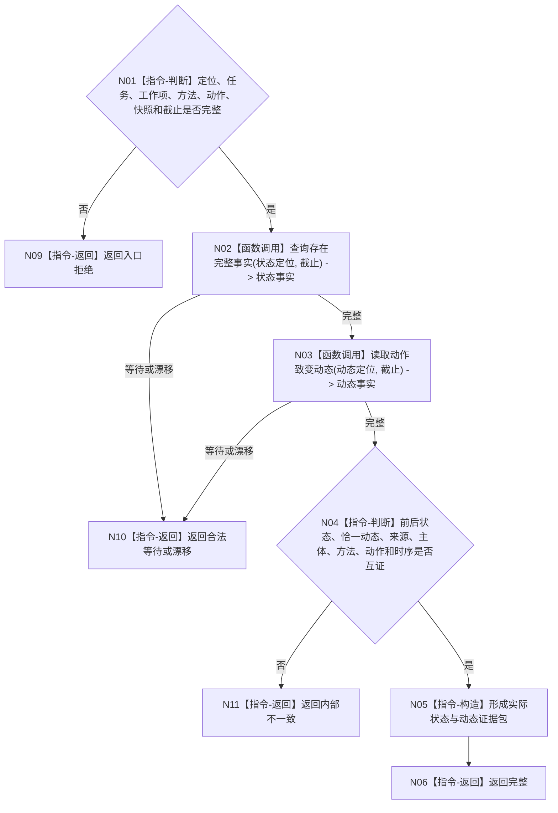

# BIZ-L4-004-05-02-03 读取实际状态与动态证据目标函数流程图 v0.1

更新时间：2026-08-03

## 依据

```text
0050、5160、5300、8100；BIZ-L3-004-05-02
```

## 身份与边界

正式目标函数设计图。按来源协议定位材料读取实际前后状态和恰一动作致变动态，并核对场景、主体、方法、动作与时间序列。

## 函数合同

```text
根函数：动作结果事实提供者::读取实际状态与动态证据
归属模块 / 文件 / 层级：动作结果事实 / 海中鱼巣/领域/提供者.动作结果事实.ixx / L4
现有或待新增：待新增；组合世界树状态与动态领域权威读取
完整签名：动作实际事实读取结果 动作结果事实提供者::读取实际状态与动态证据(const 动作实际事实读取请求& 请求) const
参数：请求为只读借用；含已复核定位材料、任务、工作项、方法、动作入口、世界快照身份和事实截止
返回结果：不可变值式结果；含完整、合法等待、漂移或内部不一致，以及前状态、实际新状态、恰一动态、来源和全部版本
被调函数流程图：世界树完整事实读取复用BIZ-L3-002-04-03；动作动态读取使用动态领域具名读取入口
父图：BIZ-L3-004-05-02
```

## 流程图



## 节点合同

| 节点 | 类型 | 输入 | 输出 | 事实读写 | 验证 |
| --- | --- | --- | --- | --- | --- |
| N02/N03 | 函数调用 | 已复核定位 | 状态与动态 | 只读 | 同截止、恰一动态 |
| N04—N06 | 指令 | 两类事实 | 实际事实包 | 无写入 | 主体、动作、时序互证 |

## 关键边界

动态不能单独证明目标满足；状态或动态缺失时返回等待/缺失，不得用回执字段补造。

