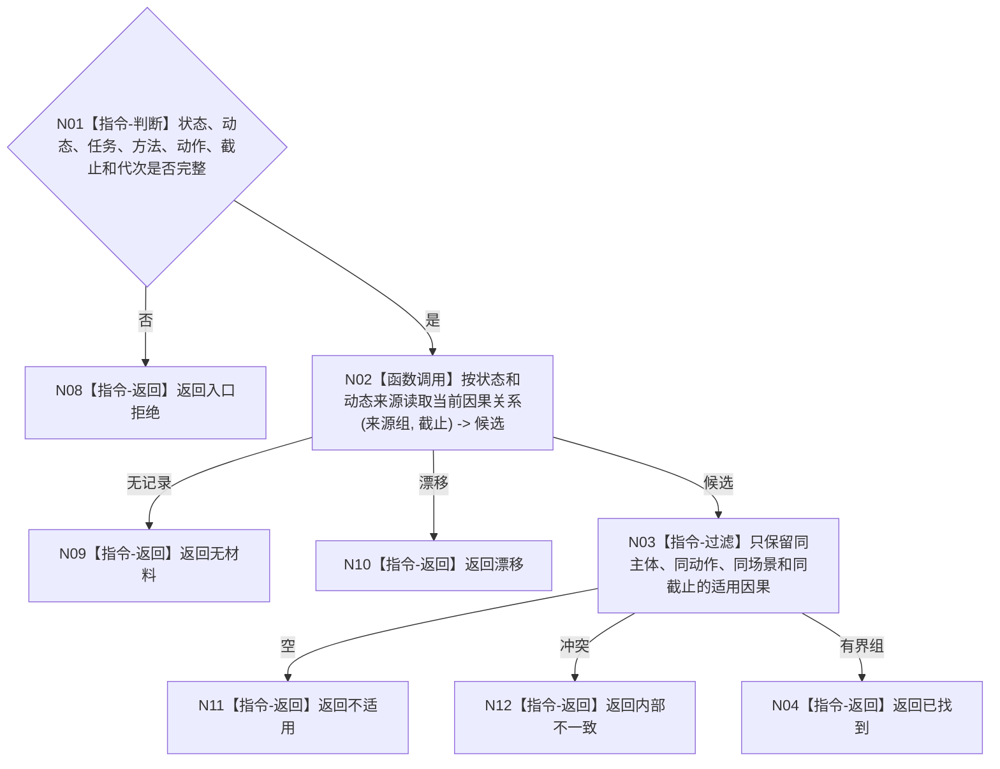

# BIZ-L4-004-05-02-04 按来源和截止读取可选因果材料目标函数流程图 v0.1

更新时间：2026-08-03

## 依据

```text
0050、5300、8100；BIZ-L3-004-05-02
```

## 身份与边界

正式目标函数设计图。以已发布实际状态和动态为来源，读取同截止可选因果材料；无适用因果是正常空结果，不影响实际事实成立。

## 函数合同

```text
根函数：因果业务服务::按来源和截止读取可选因果材料
归属模块 / 文件 / 层级：因果领域 / 海中鱼巣/领域/服务.因果.ixx / L4
现有或待新增：适配扩展；增加按实际状态/动态来源和事实截止读取
完整签名：可选因果材料读取结果 因果业务服务::按来源和截止读取可选因果材料(const 可选因果材料读取请求& 请求) const
参数：请求为只读借用；含前后状态、动作动态、任务、方法、动作入口、事实截止和运行代次
返回结果：不可变值式结果；含已找到、不适用、无材料、漂移或内部不一致，以及零项或有界因果材料组
被调函数流程图：无；按具名来源关系读取并有界过滤为简单领域读取
父图：BIZ-L3-004-05-02
```

## 流程图



## 节点合同

| 节点 | 类型 | 输入 | 输出 | 事实读写 | 验证 |
| --- | --- | --- | --- | --- | --- |
| N02 | 函数调用 | 具名来源组 | 因果候选 | 只读 | 来源可回查 |
| N03/N04 | 指令 | 候选 | 可选因果组 | 无写入 | 有界、同截止 |

## 关键边界

空因果材料不允许推翻实际状态与动态；同版本矛盾才属于内部不一致。
