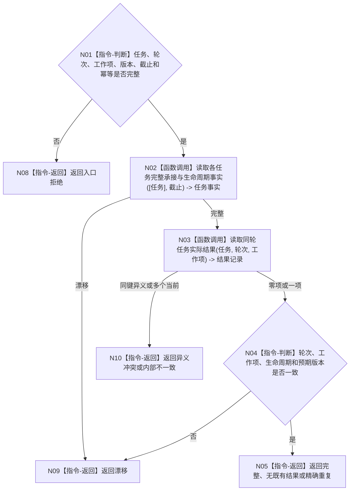

# BIZ-L4-004-06-01-01 读取任务当前轮次工作项生命周期与既有结果目标函数流程图 v0.1

更新时间：2026-08-03

## 依据

```text
0050、3200、5090、8100；BIZ-L3-004-06-01
```

## 身份与边界

正式目标函数设计图。按预期版本读取任务当前轮次、工作项、生命周期和同轮既有实际结果；不比较目标、不改变任务。

## 函数合同

```text
根函数：任务收束数据操作::读取任务当前轮次工作项生命周期与既有结果
归属模块 / 文件 / 层级：任务收束数据操作 / 海中鱼巣/领域/数据操作.任务收束.ixx / L4
现有或待新增：待新增；组合任务当前生命周期与结果记录读取
完整签名：任务当前收束事实读取结果 任务收束数据操作::读取任务当前轮次工作项生命周期与既有结果(const 任务当前收束事实读取请求& 请求) const
参数：请求为只读借用；含任务、轮次、工作项、预期任务版本、事实截止和收束幂等身份
返回结果：不可变值式结果；含完整、精确重复、无既有结果、漂移、异义冲突或内部不一致，以及当前轮次、工作项、生命周期、既有结果和版本
被调函数流程图：复用任务完整承接与生命周期读取；同轮结果为简单专用读取
父图：BIZ-L3-004-06-01
```

## 流程图



## 节点合同

| 节点 | 类型 | 输入 | 输出 | 事实读写 | 验证 |
| --- | --- | --- | --- | --- | --- |
| N02/N03 | 函数调用 | 同一任务和截止 | 生命周期与结果 | 只读 | 同轮、同工作项 |
| N04/N05 | 指令 | 当前事实 | 结构化读取结果 | 无写入 | 重复与异义分离 |

## 关键边界

结果存在不等于目标满足；只有父图使用独立比较材料裁决完成或待重筹办。
