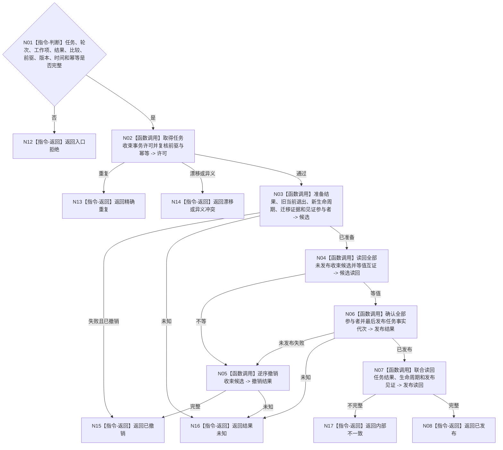

# BIZ-L4-004-06-01-02 发布任务实际结果与生命周期事务目标函数流程图 v0.1

更新时间：2026-08-03

## 依据

```text
0050、3200、4010—4050、5090、8100；BIZ-L3-004-06-01
```

## 身份与边界

正式目标函数设计图。在一个任务事实代次中发布同轮实际结果、旧生命周期退出和已完成或待重筹办新生命周期；不写需求或服务事实。

## 函数合同

```text
根函数：任务收束数据操作::发布任务实际结果与生命周期事务
归属模块 / 文件 / 层级：任务收束数据操作 / 海中鱼巣/领域/数据操作.任务收束.ixx / L4
现有或待新增：待新增；组合结果、生命周期、迁移证据和发布见证参与者
完整签名：任务收束事务发布结果 任务收束数据操作::发布任务实际结果与生命周期事务(const 任务收束事务发布请求& 请求)
参数：请求为只读借用；含任务、轮次、工作项、实际结果、目标比较结论、前驱生命周期、预期版本、发生时间、规则版本和幂等身份
返回结果：不可变值式结果；含已发布、精确重复、漂移、异义冲突、已撤销、结果未知或内部不一致，以及结果、生命周期、新版本和发布见证
被调函数流程图：参与者准备、候选读回、逆序撤销、确认和联合读回在L5展开
父图：BIZ-L3-004-06-01
```

## 流程图



## 节点合同

| 节点 | 类型 | 输入 | 输出 | 事实读写 | 验证 |
| --- | --- | --- | --- | --- | --- |
| N02—N04 | 函数调用 | 完整事务请求 | 许可与候选 | 仅未发布候选 | 同轮同工作项 |
| N05/N06 | 函数调用 | 全部候选 | 撤销或发布 | 最后切换任务代次 | 无半收束事实 |
| N07/N08 | 函数调用/返回 | 发布见证 | 独立完整读回 | 只读 | 结果与生命周期同代次 |

## 关键边界

目标未满足仍发布真实结果，但新生命周期只能是待重筹办；任何需求结算必须在本事务完成后独立进行。
