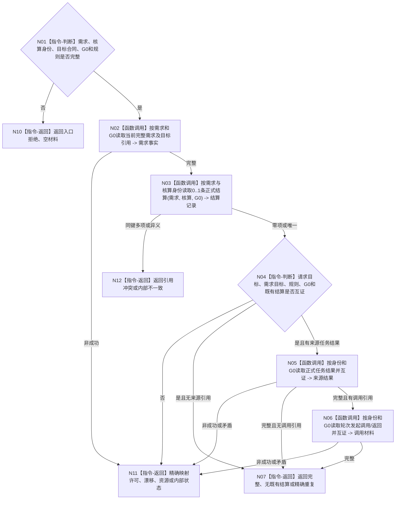

# BIZ-L4-004-06-02-01 读取需求独立结算前置事实目标函数流程图 v0.2

更新时间：2026-08-26

## 依据

```text
0050、3100、5090 v0.8、5160 v0.5、8210；BIZ-L3-004-06-02 v0.2
```

## 身份与边界

正式目标函数设计图。按需求、本次核算身份和 `G0` 读取需求当前有效性、目标合同引用及同核算身份 0..1 条既有正式结算；来源任务结果和轮次发起调用若存在，只按请求中的强类型引用校验，不把承接任务或 `T→D` 当作必需结算来源。不读取服务合同，不比较目标，不形成结算结论。

## 函数合同

```text
根函数：需求结算数据操作::读取需求独立结算前置事实
归属模块 / 文件 / 目标分解深度：需求结算数据操作 / 海中鱼巣/领域/数据操作.需求结算.ixx / BIZ-L4
现有或待新增：待新增或迁移；复用需求当前完整读取和结算 owner 指定截止读取
完整签名：需求独立结算前置读取结果 需求结算数据操作::读取需求独立结算前置事实(const 需求独立结算前置读取请求& 请求) const noexcept
参数：请求含需求、本次核算身份、目标合同、G0、结算规则版本、零或一来源任务结果引用和零或一轮次发起调用引用
返回结果：值式结果；含完整、无既有结算、精确重复、入口/许可拒绝、当前性/版本漂移、引用冲突、资源失败或内部不一致，以及需求当前事实、目标引用、可选来源引用验证和可选既有结算
被调函数流程图：复用需求当前完整读取；结算、来源结果和调用引用使用各 owner 的强类型指定截止读取
父图：BIZ-L3-004-06-02 v0.2
```

## 流程图



## 节点合同

| 节点 | 类型 | 输入 | 输出 | 事实读写 | 验证 |
| --- | --- | --- | --- | --- | --- |
| N02/N03 | 函数调用 | 同一需求、核算身份和G0 | 需求与0..1结算事实 | 只读 | 当前需求有效；同核算身份唯一 |
| N04 | 指令 | 请求与已读事实 | 基础前置闭合 | 无 | 目标合同、规则、G0和既有结算同义 |
| N05/N06 | 函数调用 | 可选来源引用 | 可选来源验证材料 | 只读任务/调用 owner | 无引用时零调用；有引用才逐字段互证 |
| N07 | 返回 | 完整前置 | 结构化结果 | 无写入 | 重复与无既有记录分离 |

## 关键边界

任务完成和 `T→D` 承接均不等于需求已满足。没有来源任务结果时仍可结算；有来源引用时必须与 fresh 事实分账互证。既有结算必须与同一需求、核算身份、目标、G0、可选来源和结论完整同义。
