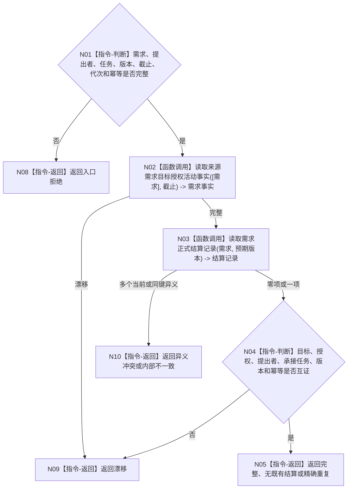

# BIZ-L4-004-06-02-01 读取需求结算前置事实目标函数流程图 v0.1

更新时间：2026-08-03

## 依据

```text
0050、3100、5090、5160、8210；BIZ-L3-004-06-02
```

## 身份与边界

正式目标函数设计图。按需求和预期版本读取当前目标、授权、承接任务及唯一正式结算；不读取服务合同，不形成结算结论。

## 函数合同

```text
根函数：需求结算数据操作::读取需求结算前置事实
归属模块 / 文件 / 层级：需求结算数据操作 / 海中鱼巣/领域/数据操作.需求结算.ixx / L4
现有或待新增：待新增；组合需求目标、授权、承接任务和结算记录读取
完整签名：需求结算前置事实读取结果 需求结算数据操作::读取需求结算前置事实(const 需求结算前置事实读取请求& 请求) const
参数：请求为只读借用；含需求、提出者、来源任务、预期需求版本、事实截止、运行代次和结算幂等身份
返回结果：不可变值式结果；含完整、无既有结算、精确重复、漂移、异义冲突或内部不一致，以及目标、授权、承接任务、既有结算和版本
被调函数流程图：需求目标/授权/活动事实读取复用BIZ-L4-004-02-02-03；结算为简单专用读取
父图：BIZ-L3-004-06-02
```

## 流程图



## 节点合同

| 节点 | 类型 | 输入 | 输出 | 事实读写 | 验证 |
| --- | --- | --- | --- | --- | --- |
| N02/N03 | 函数调用 | 同一需求与截止 | 需求和结算事实 | 只读 | 唯一当前结算 |
| N04/N05 | 指令 | 已读事实 | 结构化结果 | 无写入 | 重复与异义分离 |

## 关键边界

任务完成不等于需求已满足；既有结算必须与同一目标、任务、证据和幂等身份等义。

