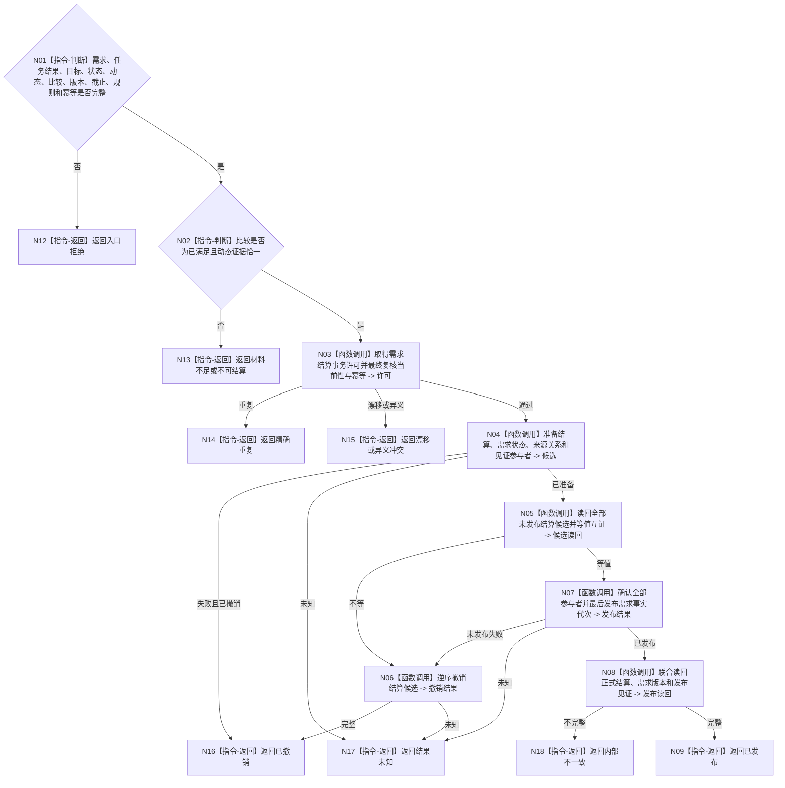

# BIZ-L4-004-06-02-02 发布需求正式结算事务目标函数流程图 v0.1

更新时间：2026-08-03

## 依据

```text
0050、3100、4010—4050、5090、5160、8210；BIZ-L3-004-06-02
```

## 身份与边界

正式目标函数设计图。在一个需求事实代次中发布唯一“已满足”结算、旧活动状态退出和新版本；不发布未满足记录，不写服务值。

## 函数合同

```text
根函数：需求结算数据操作::发布需求正式结算事务
归属模块 / 文件 / 层级：需求结算数据操作 / 海中鱼巣/领域/数据操作.需求结算.ixx / L4
现有或待新增：待新增；组合结算、需求状态、来源关系和见证参与者
完整签名：需求结算事务发布结果 需求结算数据操作::发布需求正式结算事务(const 需求结算事务发布请求& 请求)
参数：请求为只读借用；含需求、来源任务结果、目标、实际状态、恰一动态、可选因果、比较结论、预期版本、事实截止、规则版本和幂等身份
返回结果：不可变值式结果；含已发布、精确重复、漂移、异义冲突、已撤销、结果未知或内部不一致，以及正式结算、需求新版本和发布见证
被调函数流程图：参与者准备、候选读回、逆序撤销、确认和联合读回在L5展开
父图：BIZ-L3-004-06-02
```

## 流程图



## 节点合同

| 节点 | 类型 | 输入 | 输出 | 事实读写 | 验证 |
| --- | --- | --- | --- | --- | --- |
| N02/N03 | 指令/调用 | 完整证据 | 结算资格与许可 | 无发布 | 已满足、恰一动态 |
| N04—N07 | 函数调用 | 需求写集 | 候选、撤销或发布 | 最后切换需求代次 | 无半结算事实 |
| N08/N09 | 函数调用/返回 | 发布见证 | 独立完整读回 | 只读 | 唯一正式结算 |

## 关键边界

未满足、不可比较或缺少恰一动态时必须零需求写入；服务合同余款和服务值由后继独立事务裁决。
