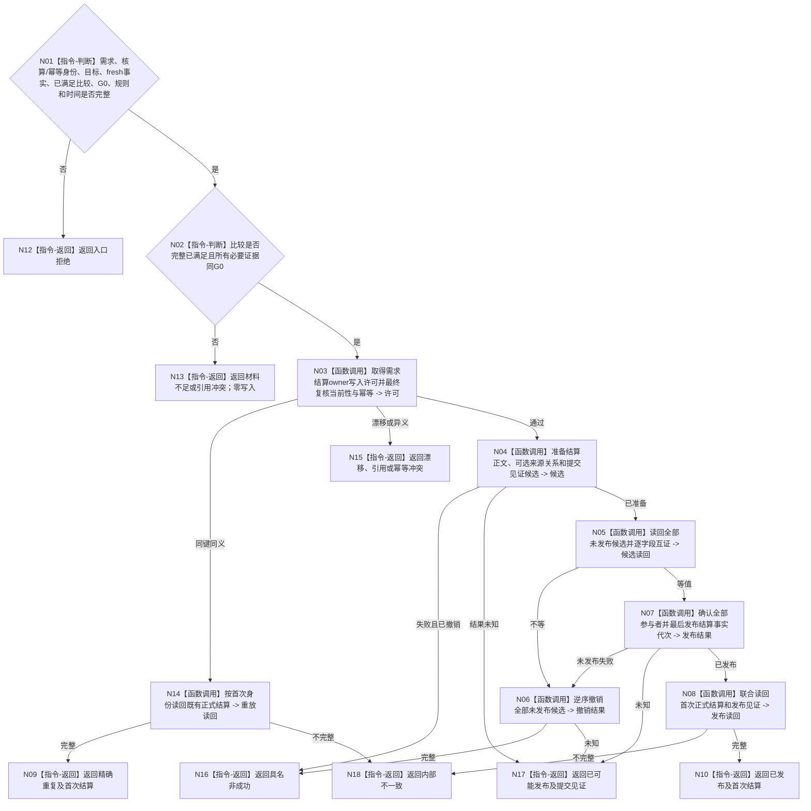

# BIZ-L4-004-06-02-02 发布需求独立正式结算事务目标函数流程图 v0.2

更新时间：2026-08-26

## 依据

```text
0050、3100、4010—4050、5090 v0.8、5160 v0.5、8210；BIZ-L3-004-06-02 v0.2
```

## 身份与边界

正式目标函数设计图。在需求结算 owner 的一个正式发布代次中，按本次核算身份发布唯一 `已满足` 结算和发布见证；不要求来源任务结果，不建立结果消费分配，不把历史满足变成永久当前布尔值，也不写服务值、价值或任务事实。

## 函数合同

```text
根函数：需求结算数据操作::发布需求独立正式结算事务
归属模块 / 文件 / 目标分解深度：需求结算数据操作 / 海中鱼巣/领域/数据操作.需求结算.ixx / BIZ-L4
现有或待新增：待新增或迁移；旧结果消费结构不得复用为生产权威
完整签名：需求独立结算事务结果 需求结算数据操作::发布需求独立正式结算事务(const 需求独立结算事务请求& 请求) noexcept
参数：请求含需求、核算身份、幂等身份、目标合同及版本、fresh实际状态与必要证据、完整已满足比较、G0、零或一来源任务结果、零或一发起调用、规则版本和正式发生时间
返回结果：值式结果；含已发布、精确重复、入口/许可拒绝、当前性/版本漂移、引用/幂等冲突、资源失败、已可能发布或内部不一致，以及首次正式结算、提交见证和读回截止
被调函数流程图：参与者准备、候选读回、逆序撤销、确认和联合读回在L5展开
父图：BIZ-L3-004-06-02
```

## 流程图



## 节点合同

| 节点 | 类型 | 输入 | 输出 | 事实读写 | 验证 |
| --- | --- | --- | --- | --- | --- |
| N02/N03 | 判断 / 调用 | 完整目标、fresh、比较、G0和可选来源 | 结算资格与许可 | 无发布 | 不要求任务结果或恰一动态；只要求目标合同规定的必要证据 |
| N04—N07 | 函数调用 | 结算owner写集 | 候选、撤销或发布 | 最后切换结算事实代次 | 无半结算事实；不写需求当前满足布尔 |
| N14/N08 | 函数调用 | 既有或新发布身份 | 首次结算正式读回 | 只读 | 同键重放回首次记录 |
| N09/N10/N12—N18 | 返回 | 读回或具名非成功 | 结构化事务结果 | 无额外写入 | 已可能发布保留见证 |

## 关键边界

未满足、不可比较或缺少目标合同规定的必要证据时必须零正式满足写入。来源任务结果、调用返回、服务合同、价值和归因都不是本事务必填项；有值时只作不可变引用。服务合同余款和服务值由后继独立事务裁决。
