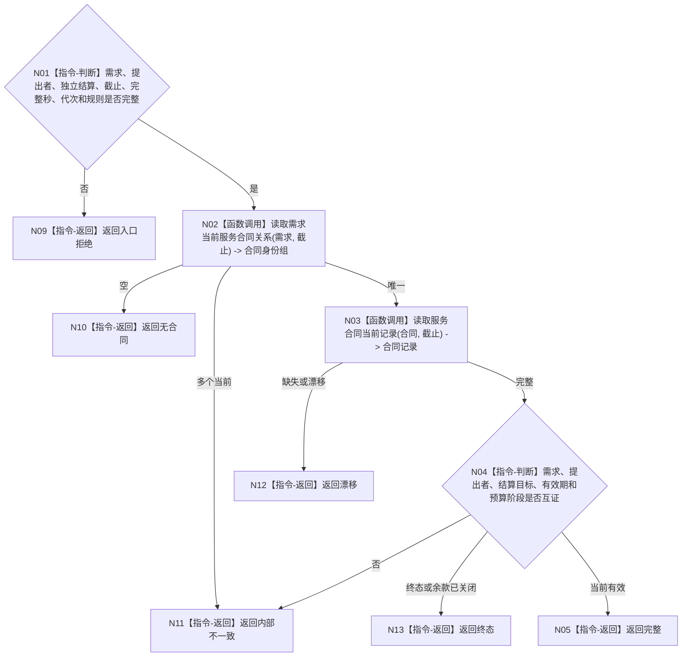

# BIZ-L4-004-06-03-01 读取需求当前服务合同目标函数流程图 v0.2

更新时间：2026-08-26

## 依据

```text
0050、5160 v0.5、6100、6160、6170；BIZ-L3-004-06-03 v0.2
```

## 身份与边界

正式目标函数设计图。按需求、提出者、已发布需求独立结算和事实截止读取唯一当前直接服务合同、预算阶段和有效期；来源任务不是合同读取必填键，不迁移合同、不支付余款。

## 函数合同

```text
根函数：服务合同数据操作::读取需求当前服务合同
归属模块 / 文件 / 目标分解深度：服务合同数据操作 / 海中鱼巣/领域/数据操作.服务合同.ixx / BIZ-L4
现有或待新增：待新增；组合需求—合同关系与合同当前记录读取
完整签名：当前服务合同读取结果 服务合同数据操作::读取需求当前服务合同(const 当前服务合同读取请求& 请求) const
参数：请求为只读借用；含需求、提出者、已发布需求独立结算、事实截止、完整秒边界、运行代次和规则版本
返回结果：不可变值式结果；含无合同、完整、终态、漂移或内部不一致，以及合同、状态、预算阶段、有效期和版本
被调函数流程图：无；关系与合同记录使用同截止简单专用读取
父图：BIZ-L3-004-06-03
```

## 流程图



## 节点合同

| 节点 | 类型 | 输入 | 输出 | 事实读写 | 验证 |
| --- | --- | --- | --- | --- | --- |
| N02/N03 | 函数调用 | 同一截止 | 合同身份与记录 | 只读 | 唯一当前 |
| N04/N05 | 指令 | 合同记录 | 当前合同 | 无写入 | 提出者、目标、预算互证 |

## 关键边界

合同存在或需求已满足都不等于余款已支付；来源任务有无不改变直接合同身份。本函数只返回当前绑定材料。
