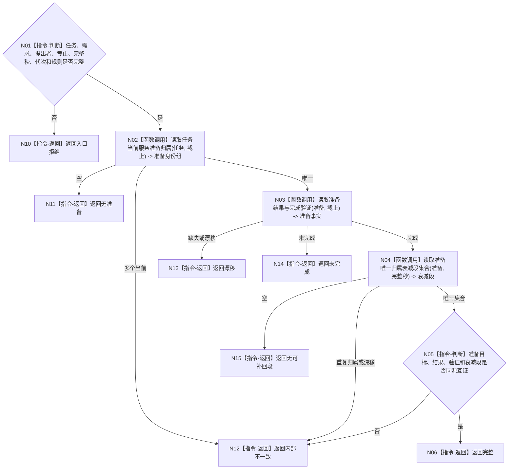

# BIZ-L4-004-06-03-02 读取任务服务准备与衰减段归属目标函数流程图 v0.1

更新时间：2026-08-03

## 依据

```text
0050、5160、6100、6160、6170；BIZ-L3-004-06-03
```

## 身份与边界

正式目标函数设计图。按来源任务读取唯一服务准备、实际新结果、完成验证及可补回衰减段归属；不计算补回量、不写服务值。

## 函数合同

```text
根函数：服务准备数据操作::读取任务服务准备与衰减段归属
归属模块 / 文件 / 层级：服务准备数据操作 / 海中鱼巣/领域/数据操作.服务准备.ixx / L4
现有或待新增：待新增；组合准备归属、结果、验证与服务值衰减段读取
完整签名：服务准备归属读取结果 服务准备数据操作::读取任务服务准备与衰减段归属(const 服务准备归属读取请求& 请求) const
参数：请求为只读借用；含来源任务、需求、提出者、事实截止、完整秒边界、运行代次和规则版本
返回结果：不可变值式结果；含无准备、完整、未完成、无可补回段、漂移或内部不一致，以及准备、结果、验证和唯一衰减段集合
被调函数流程图：无；准备、结果与衰减段使用同截止简单专用读取
父图：BIZ-L3-004-06-03
```

## 流程图



## 节点合同

| 节点 | 类型 | 输入 | 输出 | 事实读写 | 验证 |
| --- | --- | --- | --- | --- | --- |
| N02—N04 | 函数调用 | 同一任务与截止 | 准备、结果、验证、衰减段 | 只读 | 唯一归属 |
| N05/N06 | 指令 | 全部准备事实 | 完整绑定 | 无写入 | 同目标、同来源、同秒顺序 |

## 关键边界

准备完成仅形成后继补回资格；补回量不得超过该准备归属且尚未补回的实际衰减段。

