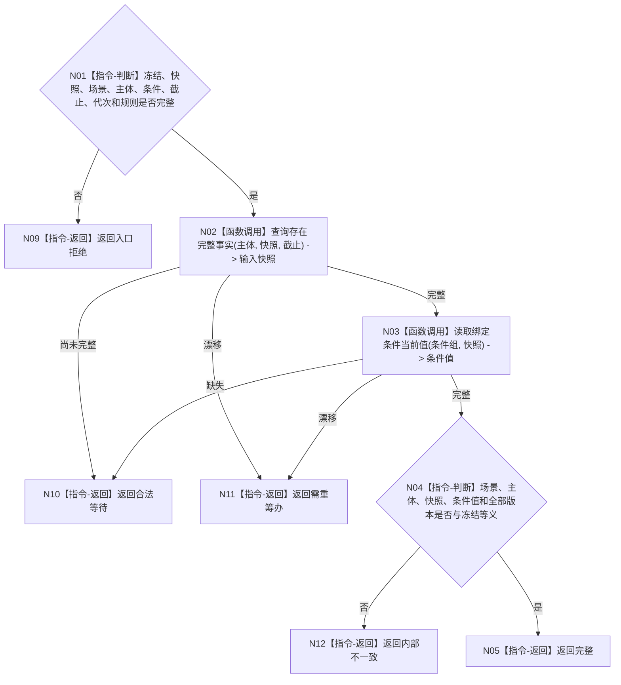

# BIZ-L4-004-07-02-01 读取冻结输入场景与绑定条件当前事实目标函数流程图 v0.1

更新时间：2026-08-03

## 依据

```text
0050、4200、5090、5300、8100；BIZ-L3-004-07-02
```

## 身份与边界

正式目标函数设计图。按冻结输入和事实截止读取同代次世界/场景/主体完整快照与绑定条件当前值；不更新输入冻结。

## 函数合同

```text
根函数：任务执行输入事实提供者::读取冻结输入场景与绑定条件当前事实
归属模块 / 文件 / 层级：任务执行输入事实 / 海中鱼巣/领域/提供者.任务执行输入事实.ixx / L4
现有或待新增：待新增；组合世界树完整快照与条件特征读取
完整签名：任务执行输入事实读取结果 任务执行输入事实提供者::读取冻结输入场景与绑定条件当前事实(const 任务执行输入事实读取请求& 请求) const
参数：请求为只读借用；含输入冻结、世界快照身份、场景、主体、绑定条件、事实截止、运行代次和规则版本
返回结果：不可变值式结果；含完整、合法等待、需重筹办、漂移或内部不一致，以及完整输入快照、条件值和全部来源版本
被调函数流程图：世界树完整快照读取复用BIZ-L3-002-04-03；特征比较材料按登记合同读取
父图：BIZ-L3-004-07-02
```

## 流程图



## 节点合同

| 节点 | 类型 | 输入 | 输出 | 事实读写 | 验证 |
| --- | --- | --- | --- | --- | --- |
| N02/N03 | 函数调用 | 冻结定位与截止 | 快照和条件值 | 只读 | 同快照、同版本 |
| N04/N05 | 指令 | 输入事实 | 完整结果 | 无写入 | 不按缓存补齐 |

## 关键边界

输入漂移只能返回重筹办或等待；执行阶段不得重新绑定输入、参数或目标。

