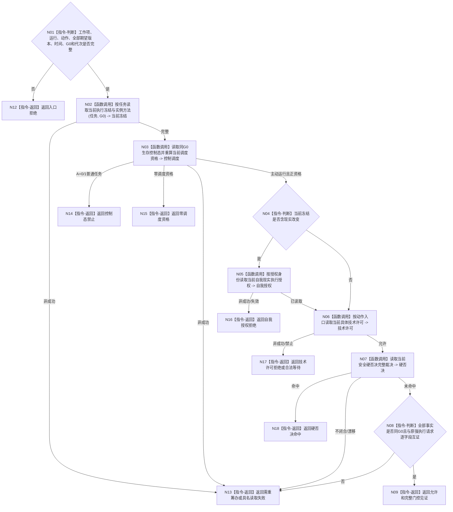

# BIZ-L4-004-07-02-02 读取动作开始治理事实目标函数流程图 v0.1

更新时间：2026-08-03

## 依据

```text
0050、5090、5230、6170、8100；BIZ-L3-004-07-02
```

## 身份与边界

正式目标函数设计图。动作开始前按新的共同截止 fresh 读取当前执行冻结、生存控制、调度资格、按需自我现实执行授权、具体技术许可和安全硬否决；本函数只形成门控结果，不消费通用令牌。

## 函数合同

```text
根函数：动作治理事实提供者::读取动作开始治理事实
归属模块 / 文件 / 层级：动作治理事实 / 海中鱼巣/领域/提供者.动作治理事实.ixx / L4
现有或待新增：待新增；组合当前冻结、生存控制、调度资格、按需自我授权、具体技术许可和安全硬否决读取
完整签名：动作开始治理事实读取结果 动作治理事实提供者::读取动作开始治理事实(const 动作开始治理事实读取请求& 请求) const
参数：请求为只读借用；含任务、工作项、方法运行、动作入口、执行冻结、自我授权、技术许可、调度与硬否决规则版本、当前时间、事实截止与运行代次
返回结果：不可变值式结果；含允许、合法等待、控制态禁止、零调度资格、自我授权拒绝、技术许可拒绝、硬否决命中、需重筹办、过期或内部不一致，以及完整治理见证
被调函数流程图：执行冻结、生存控制、调度资格、自我授权、技术许可和安全硬否决使用各领域具名只读入口
父图：BIZ-L3-004-07-02
```

## 流程图



## 节点合同

| 节点 | 类型 | 输入 | 输出 | 事实读写 | 验证 |
| --- | --- | --- | --- | --- | --- |
| N02—N07 | 函数调用 | 动作、工作项、冻结和G0 | 冻结、控制、调度、自我授权、技术许可、硬否决 | 只读 | 同G0且各自正式来源 |
| N08/N09 | 指令 | 全部 fresh 治理事实 | 允许见证 | 无写入 | 不消费通用许可；保留全部门控来源 |

## 关键边界

本函数返回允许不等于动作已开始或成功。不存在需要原子消费的旧通用执行令牌；真正动作入口只能消费本次同G0完整门控结果，并仍由实际事实owner按自身事务合同提交现实改变。
