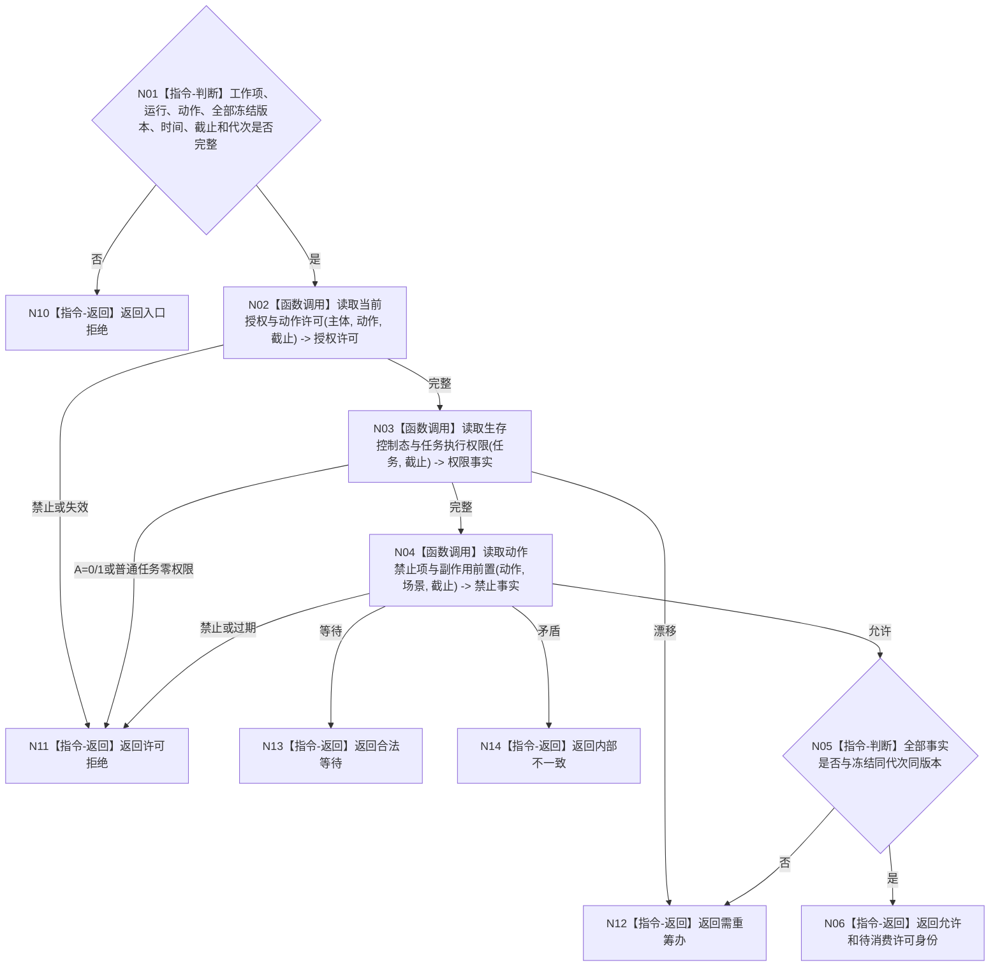

# BIZ-L4-004-07-02-02 读取动作开始治理事实目标函数流程图 v0.1

更新时间：2026-08-03

## 依据

```text
0050、5090、5230、6170、8100；BIZ-L3-004-07-02
```

## 身份与边界

正式目标函数设计图。动作开始前同截止读取当前授权、一次性许可、生存控制、任务权限与禁止项；本函数不消费许可。

## 函数合同

```text
根函数：动作治理事实提供者::读取动作开始治理事实
归属模块 / 文件 / 层级：动作治理事实 / 海中鱼巣/领域/提供者.动作治理事实.ixx / L4
现有或待新增：待新增；组合授权、许可、安全/服务权限和禁止项读取
完整签名：动作开始治理事实读取结果 动作治理事实提供者::读取动作开始治理事实(const 动作开始治理事实读取请求& 请求) const
参数：请求为只读借用；含任务、工作项、方法运行、动作入口、授权、许可、权限和禁止项冻结版本、当前时间、事实截止与运行代次
返回结果：不可变值式结果；含允许、合法等待、许可拒绝、需重筹办、过期或内部不一致，以及治理见证和待消费许可身份
被调函数流程图：授权、许可、生存控制和权限使用各领域具名只读入口
父图：BIZ-L3-004-07-02
```

## 流程图



## 节点合同

| 节点 | 类型 | 输入 | 输出 | 事实读写 | 验证 |
| --- | --- | --- | --- | --- | --- |
| N02—N04 | 函数调用 | 动作与工作项 | 授权、权限、禁止事实 | 只读 | 同截止 |
| N05/N06 | 指令 | 治理事实 | 允许见证 | 无写入 | 不消费许可 |

## 关键边界

本函数返回允许不等于动作已开始。一次性许可必须由真正动作入口在开始前再次复核并消费。
