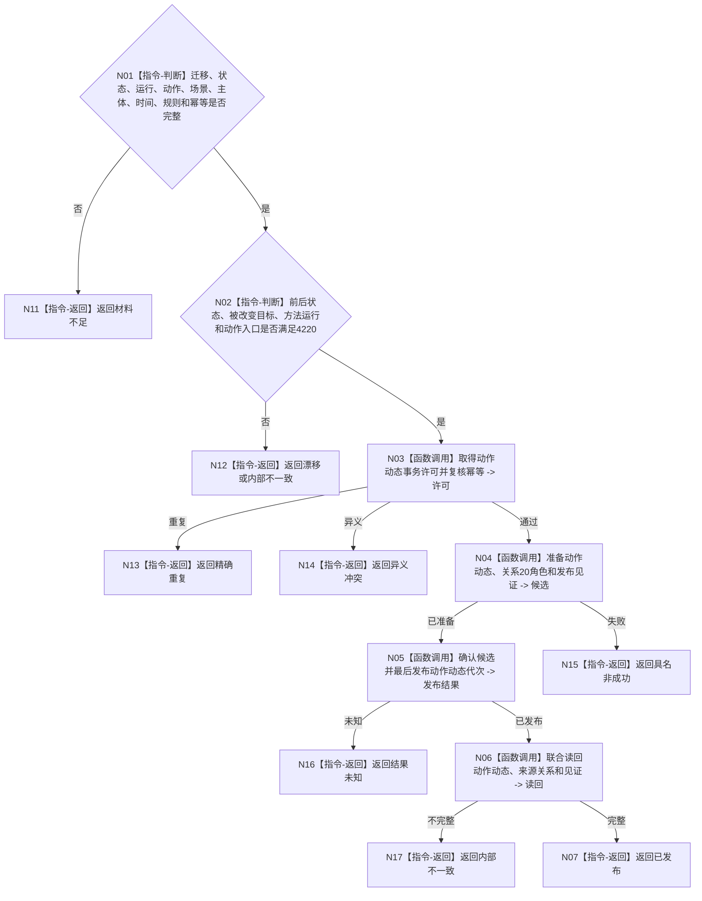

# BIZ-L4-004-07-04-01 发布动作致变动态目标函数流程图 v0.1

更新时间：2026-08-03

## 依据

```text
0050、4190、4220、5300、8210；BIZ-L3-004-07-04
```

## 身份与边界

正式目标函数设计图。引用已发布状态迁移动能和方法运行，独立发布动作致变动态及来源关系；不撤销或重写前级状态。

## 函数合同

```text
根函数：动态业务服务::发布动作致变动态
归属模块 / 文件 / 层级：动态领域 / 海中鱼巣/领域/服务.动态.ixx / L4
现有或待新增：适配扩展；按4220补齐方法运行、动作入口和被改变目标同源合同
完整签名：动作致变动态发布结果 动态业务服务::发布动作致变动态(const 动作致变动态发布请求& 请求)
参数：请求为只读借用；含迁移动能、前后状态、方法运行、动作入口、场景、主体、发生时间、规则版本和幂等身份
返回结果：不可变值式结果；含已发布、精确重复、材料不足、漂移、异义冲突、结果未知或内部不一致，以及动作动态、来源关系和发布见证
被调函数流程图：动态与来源关系事务参与者在L5展开
父图：BIZ-L3-004-07-04
```

## 流程图



## 节点合同

| 节点 | 类型 | 输入 | 输出 | 事实读写 | 验证 |
| --- | --- | --- | --- | --- | --- |
| N02/N03 | 指令/调用 | 已发布迁移与运行 | 发布资格 | 无状态写入 | 4220同源 |
| N04—N06 | 函数调用 | 动态写集 | 发布与读回 | 动态领域 | 前级状态不可回滚 |

## 关键边界

结果未知时只按原幂等身份收敛；不得重做外部动作，也不得删除已经发布的真实状态。
