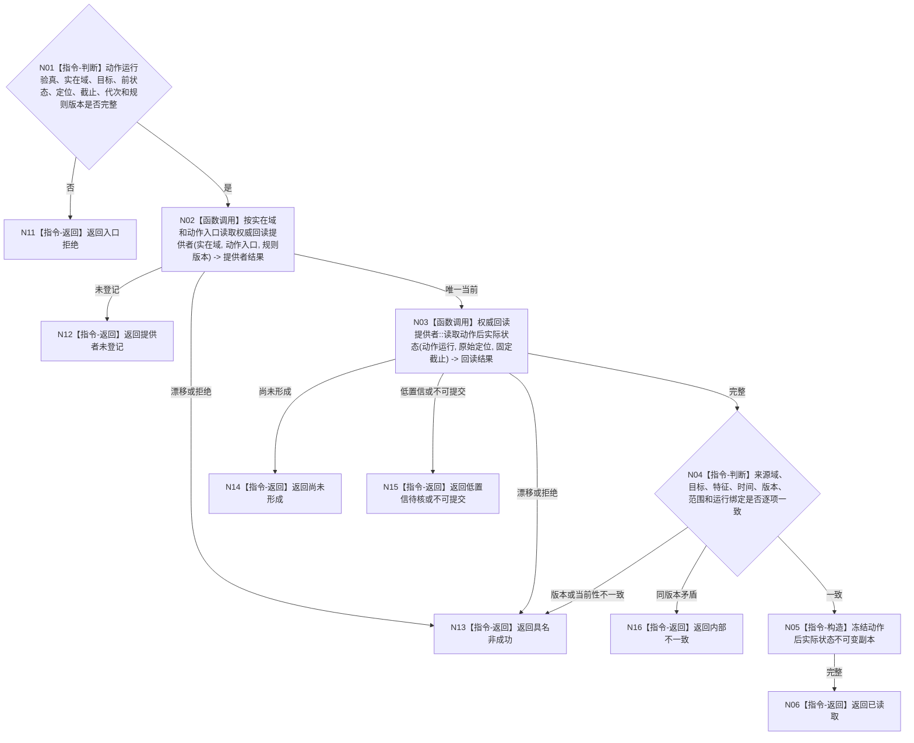

# BIZ-L4-004-07-04-02 按实在域读取动作后实际状态目标函数流程图 v0.1

更新时间：2026-08-04

## 依据

```text
0050、4190、4220、8100、8210；BIZ-L3-004-07-04；确认稿第22、38项
```

## 身份与边界

正式目标函数设计图。根据冻结动作规格中的实在域和已验真动作运行身份，调用该实在域登记的权威实际回读提供者；不得从方法返回、预计动态、完成消息、任务回执或日志补造动作后状态。

## 函数合同

```text
根函数：动作实际回读路由::按实在域读取动作后实际状态
归属模块 / 文件 / 层级：动作实际回读路由 / 海中鱼巣/领域/路由.动作实际回读.ixx / L4
现有或待新增：待新增；当前代码把调度请求中的预计值直接提交为实际状态，不能复用
完整签名：动作后实际状态读取结果 动作实际回读路由::按实在域读取动作后实际状态(const 动作后实际状态读取请求& 请求) const
参数：请求为只读借用；含已验真动作运行身份、实在域、目标对象、目标特征、动作前状态及版本、原始回读定位、回读截止、运行代次、来源规则版本和要求的最低置信
返回结果：调用方拥有的不可变值式结果；含已读取、尚未形成、低置信待核、不可提交、提供者未登记、版本漂移、许可拒绝或内部不一致，以及原始实际回读、来源域、时间、版本、范围和置信
被调函数流程图：具体实在域权威回读提供者只在该动作主题已经正式登记且隐藏非平凡过程时继续展开；不得生成默认物理外设或默认治理动作函数
父图：BIZ-L3-004-07-04
```

## 流程图



## 节点合同

| 节点 | 类型 | 参数 / 输入绑定 | 结果 / 输出绑定 | 事实读写 | 后继条件 | 验证 |
| --- | --- | --- | --- | --- | --- | --- |
| N02 | 函数调用 | 实在域、动作入口、规则版本 | 唯一权威提供者 | 只读登记 | 唯一当前 | 不从线程或日志推断提供者 |
| N03/N04 | 函数调用 / 判断 | 已验真运行和原始定位 | 带来源、时间、版本、范围和置信的实际回读 | 只读实在域 | 材料一致 | 方法返回和预计动态不能补值 |
| N05/N06 | 构造 / 返回 | 完整实际回读 | 值式读取结果 | 无写入 | 完整 | 不在读取路由发布状态 |
| N11—N16 | 返回 | 非成功分类 | 结构化非成功 | 无写入 | 唯一分类 | 等待、低置信、漂移和矛盾分离 |

## 关键边界

物理外部域、内部治理域、仓库域和推理域必须使用各自正式登记的实际回读提供者。缺少提供者或回读尚未形成时只能等待或形成缺口；不得退回当前代码中“调用方传入实际值”的旧路线。
