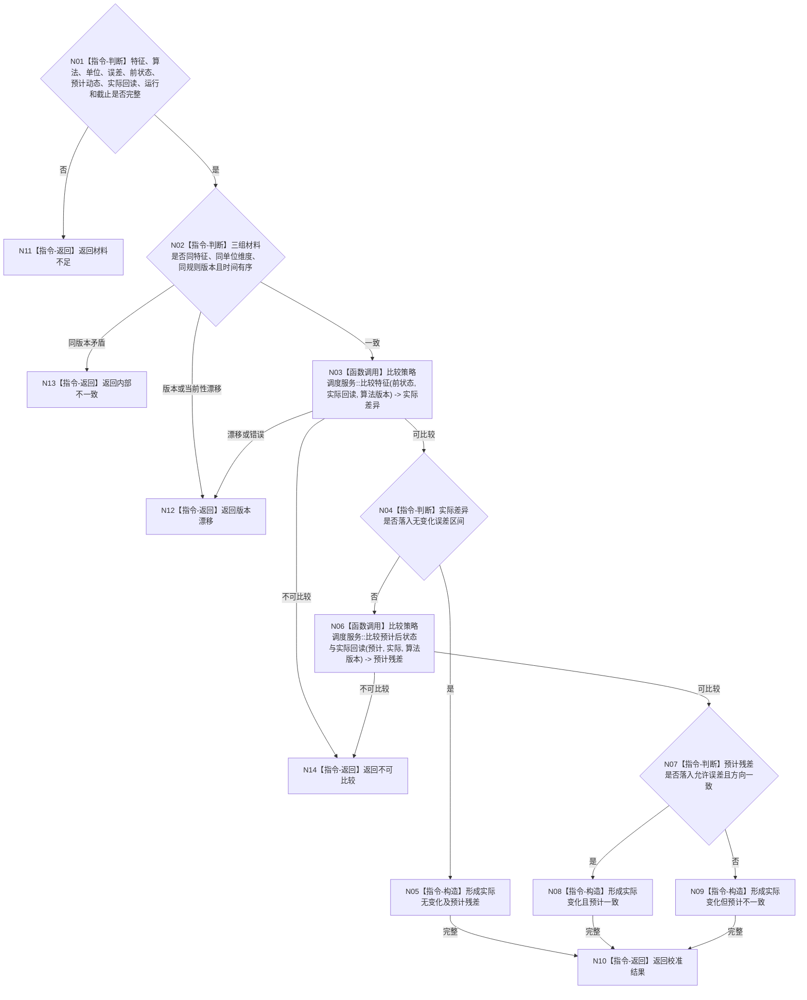

# BIZ-L4-004-07-04-03 比较动作前状态预计动态与实际状态目标函数流程图 v0.1

更新时间：2026-08-04

## 依据

```text
0050、4130、4180、4220、8210；BIZ-L3-004-07-04；确认稿第22、38项
```

## 身份与边界

正式目标函数设计图。使用目标特征已登记的比较算法，对动作前状态、预计动作动态和权威实际回读进行纯值校准；本函数不发布状态、动态、任务结果或需求结论。

## 函数合同

```text
根函数：动作结果校准器::比较动作前状态预计动态与实际状态
归属模块 / 文件 / 层级：动作结果校准算法 / 海中鱼巣/领域/算法.动作结果校准.ixx / L4
现有或待新增：待新增；复用4180已登记比较算法，不建立通用无语义减法
完整签名：动作结果校准结果 动作结果校准器::比较动作前状态预计动态与实际状态(const 动作结果校准请求& 请求) const
参数：请求为只读借用；含目标特征定义、比较算法及版本、单位维度、误差预算、动作前状态、预计动作动态、权威实际回读、动作运行身份和固定事实截止
返回结果：调用方拥有的不可变值式结果；含实际无变化、实际变化且预计一致、实际变化但预计不一致、不可比较、材料不足、版本漂移或内部不一致，以及实际变化量、预计残差、目标残差、方向、误差裁决和来源版本
被调函数流程图：4180比较策略调度入口；具体算法只在特征定义、用途和算法版本正式登记后复用其目标函数图
父图：BIZ-L3-004-07-04
```

## 流程图



## 节点合同

| 节点 | 类型 | 参数 / 输入绑定 | 结果 / 输出绑定 | 事实读写 | 后继条件 | 验证 |
| --- | --- | --- | --- | --- | --- | --- |
| N02 | 判断 | 三组状态材料 | 一致性裁决 | 无写入 | 一致或非成功 | 不跨单位和版本比较 |
| N03/N06 | 函数调用 | 已登记算法和状态对 | 实际差异、预计残差 | 纯值计算 | 可比较 | 方向、误差和溢出遵守4180 |
| N04/N07 | 判断 | 差异及误差预算 | 三类校准分支 | 无写入 | 唯一分支 | 无变化与预计一致分账 |
| N05/N08—N10 | 构造 / 返回 | 校准分支 | 不可变校准结果 | 无写入 | 完整 | 不产生正式事实 |

## 关键边界

当前目标包未登记具体特征时，本函数合同成立但具体算法分支保持条件未启用。执行计划必须绑定具名特征定义、用途、比较算法和版本；不得由执行智能体选择默认减法或默认误差。
