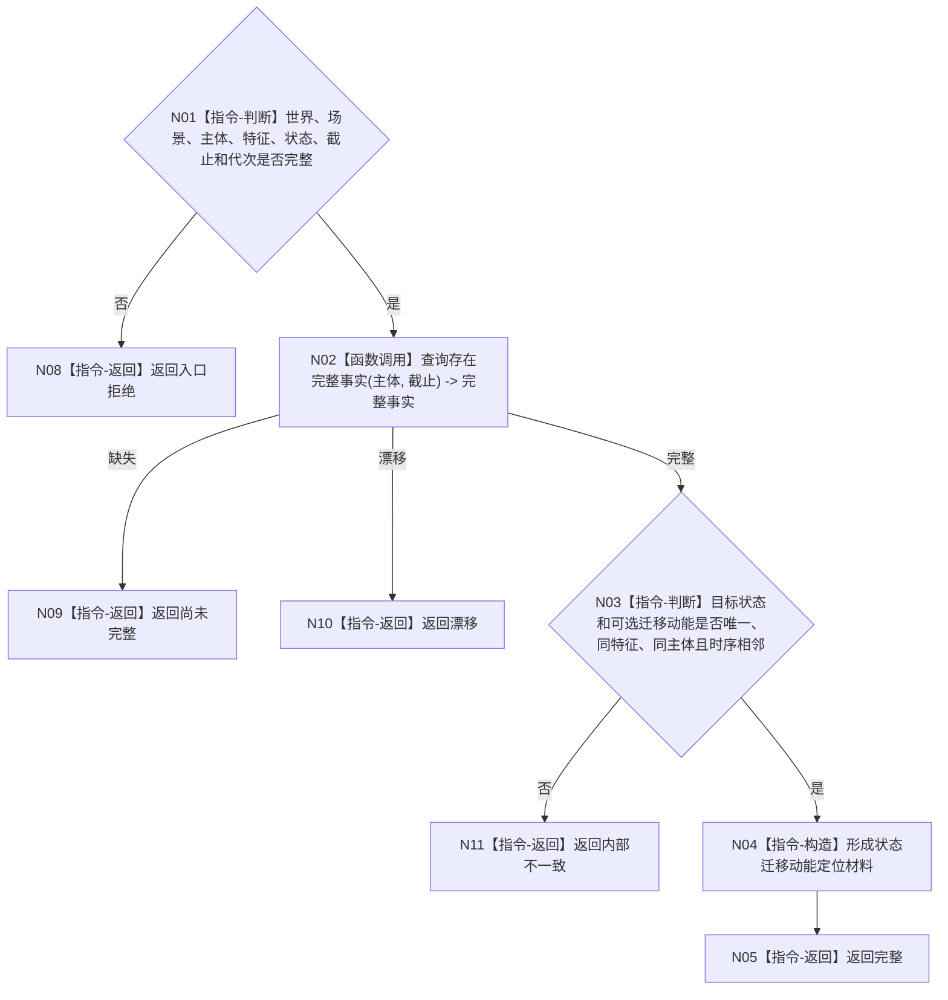

# BIZ-L4-004-07-05-01 按状态身份读取状态与迁移动能目标函数流程图 v0.1

更新时间：2026-08-03

## 依据

```text
0050、4190、4200、8210；BIZ-L3-004-07-05
```

## 身份与边界

正式目标函数设计图。按提交结果中的稳定状态身份读取已发布前后状态和可选迁移动能，只形成回执定位材料。

## 函数合同

```text
根函数：世界树业务服务::按状态身份读取状态与迁移动能
归属模块 / 文件 / 层级：世界树业务服务 / 海中鱼巣/领域/服务.世界树.ixx / L4
现有或待新增：待新增轻量读取；复用完整快照中的状态与迁移动能投影
完整签名：状态迁移动能定位读取结果 世界树业务服务::按状态身份读取状态与迁移动能(const 状态迁移动能定位读取请求& 请求) const
参数：请求为只读借用；含世界、场景、主体、特征、状态身份、可选迁移动能身份、事实截止和运行代次
返回结果：不可变值式结果；含完整、尚未完整、漂移或内部不一致，以及前状态、后状态、可选迁移动能和版本
被调函数流程图：状态、迁移动能、动态、存在和场景分别复用各自公开指定截止读取；不再依赖已退出的002-04世界事实白名单分支
父图：BIZ-L3-004-07-05
```

## 流程图



## 节点合同

| 节点 | 类型 | 输入 | 输出 | 事实读写 | 验证 |
| --- | --- | --- | --- | --- | --- |
| N02 | 函数调用 | 稳定身份与截止 | 世界树完整事实 | 只读 | 不从提交返回补值 |
| N03—N05 | 指令 | 完整事实 | 定位材料 | 无写入 | 唯一、同源、时序相邻 |

## 关键边界

本结果不能直接证明任务目标满足，只供工作线程构造稳定定位回执。
