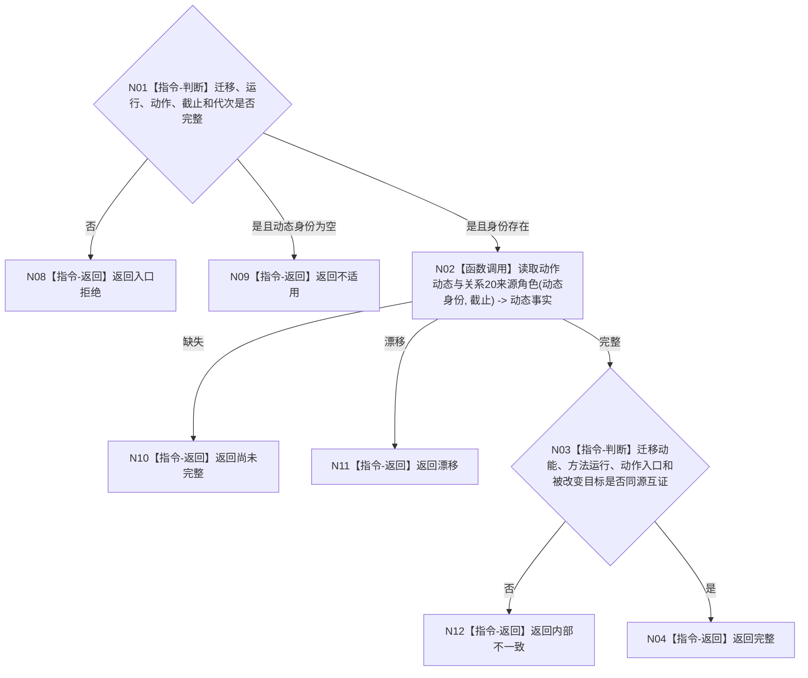

# BIZ-L4-004-07-05-02 按身份读取动作致变动态目标函数流程图 v0.1

更新时间：2026-08-03

## 依据

```text
0050、4220、5300、8210；BIZ-L3-004-07-05
```

## 身份与边界

正式目标函数设计图。按可选动作动态身份读取动作致变动态、方法运行和关系20来源角色；未要求动作动态时返回不适用。

## 函数合同

```text
根函数：动态业务服务::按身份读取动作致变动态
归属模块 / 文件 / 层级：动态领域 / 海中鱼巣/领域/服务.动态.ixx / L4
现有或待新增：适配扩展；增加稳定身份和事实截止读取
完整签名：动作致变动态定位读取结果 动态业务服务::按身份读取动作致变动态(const 动作致变动态定位读取请求& 请求) const
参数：请求为只读借用；含可选动作动态身份、迁移动能、方法运行、动作入口、事实截止和运行代次
返回结果：不可变值式结果；含完整、不适用、尚未完整、漂移或内部不一致，以及动作动态、来源关系和版本
被调函数流程图：无；动态与来源关系为同许可简单读取
父图：BIZ-L3-004-07-05
```

## 流程图



## 节点合同

| 节点 | 类型 | 输入 | 输出 | 事实读写 | 验证 |
| --- | --- | --- | --- | --- | --- |
| N02 | 函数调用 | 动态身份与截止 | 动态和来源关系 | 只读 | 同许可 |
| N03/N04 | 指令 | 动态事实 | 定位结果 | 无写入 | 4220同源 |

## 关键边界

未要求动作动态是正常不适用；要求但尚未发布时必须返回尚未完整，不能用日志或回执补造。
