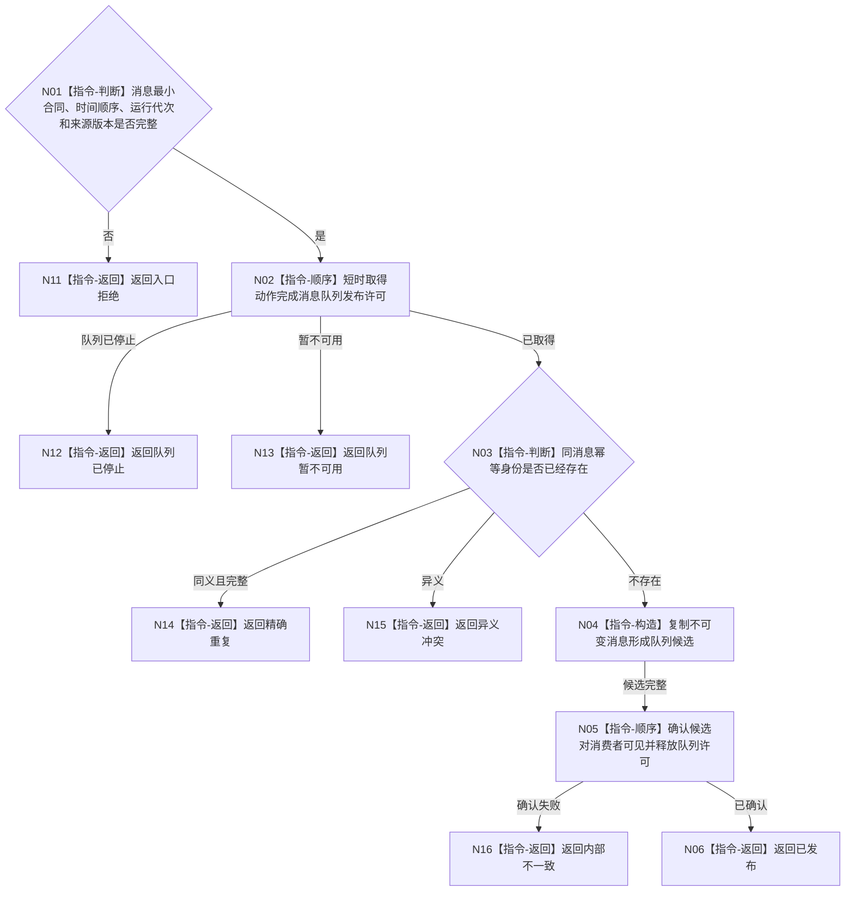

# BIZ-L4-004-07-08-01 发布或重试动作完成消息目标函数流程图 v0.1

更新时间：2026-08-04

## 依据

```text
0050、4050、8100、8210；BIZ-L3-004-07-08；确认稿第22、38项
```

## 身份与边界

正式目标函数设计图。只把同一不可变动作完成消息发布到动作完成消息边界；队列暂不可用时保留同一消息待重试，不重新执行动作，也不把消息解释为实际状态或正式动态。

## 函数合同

```text
根函数：动作完成消息队列::发布或重试动作完成消息
归属模块 / 文件 / 层级：动作完成消息队列 / 海中鱼巣/线程/动作完成消息队列.ixx / L4
现有或待新增：待新增；现有任务结果回执队列不能替代动作完成消息边界
完整签名：动作完成消息发布结果 动作完成消息队列::发布或重试动作完成消息(const 动作完成消息& 消息)
参数：消息为只读借用；含消息身份、任务、工作项、方法运行、动作入口、动作幂等键、预计动态、开始结束时间、运行代次和来源版本；调用期间不转移所有权
返回结果：调用方拥有的不可变值式结果；含已发布、精确重复、队列暂不可用、队列已停止、异义冲突、入口拒绝或内部不一致，以及消息身份和发布位置版本
被调函数流程图：无；队列短时准备、同键比较和确认属于本函数内具体指令
父图：BIZ-L3-004-07-08
```

## 流程图



## 节点合同

| 节点 | 类型 | 参数 / 输入绑定 | 结果 / 输出绑定 | 事实读写 | 后继条件 | 验证 |
| --- | --- | --- | --- | --- | --- | --- |
| N01 | 判断 | 不可变消息 | 准入结论 | 无业务写入 | 完整或拒绝 | 时间、代次和来源版本 |
| N02—N05 | 本函数内指令 | 同一消息 | 队列候选和发布状态 | 只写消息传递边界 | 发布、重复、暂不可用或冲突 | 锁内不调用领域服务 |
| N06/N11—N16 | 返回 | 发布裁决 | 结构化结果 | 无业务事实写入 | 唯一分类 | 暂不可用不重做动作 |

## 关键边界

消息发布只证明传递候选可见，不证明动作运行、实际状态、正式动态、任务完成或需求满足。调用方在任何发布非成功后都不得换消息身份或重新执行动作。
