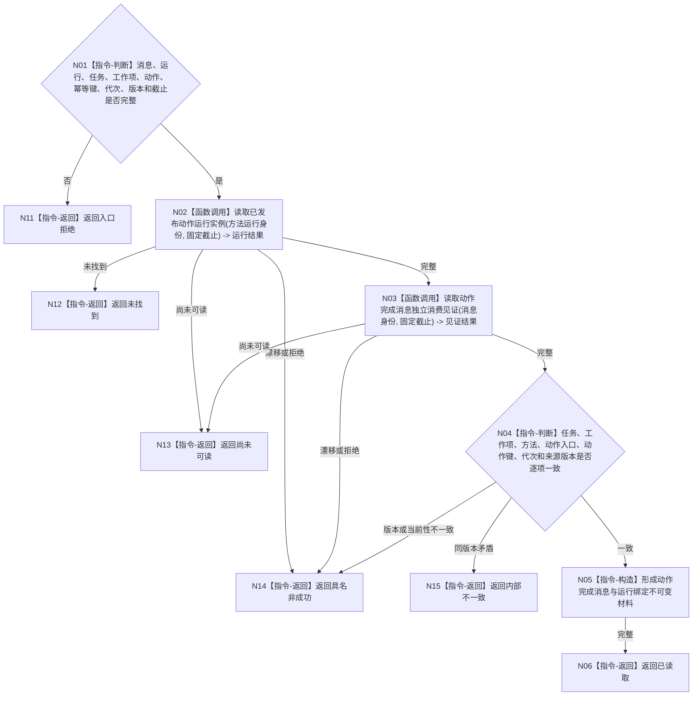

# BIZ-L4-004-07-08-02 读取动作完成消息与运行绑定目标函数流程图 v0.1

更新时间：2026-08-04

## 依据

```text
0050、4050、5300、8100、8210；BIZ-L3-004-07-08；确认稿第22、38项
```

## 身份与边界

正式目标函数设计图。从动作运行领域的已发布运行实例和独立消息消费见证读取绑定，不信任发送方回执、队列地址、日志或线程状态；本函数只验真定位关系，不读取或发布动作后实际状态。

## 函数合同

```text
根函数：动作运行业务服务::读取动作完成消息与运行绑定
归属模块 / 文件 / 层级：动作运行领域服务 / 海中鱼巣/领域/服务.动作运行.ixx / L4
现有或待新增：待新增；当前代码没有独立动作运行登记或完成消息验真入口
完整签名：动作运行绑定读取结果 动作运行业务服务::读取动作完成消息与运行绑定(const 动作运行绑定读取请求& 请求) const
参数：请求为只读借用；含完成消息身份、方法运行身份、预期任务、工作项、动作入口、动作幂等键、运行代次、来源版本和事实截止
返回结果：调用方拥有的不可变值式结果；含已读取、尚未可读、未找到、版本漂移、许可拒绝或内部不一致，以及动作运行实例、完成消息消费见证、逐项绑定和来源版本
被调函数流程图：动作运行实例和消息消费见证的同许可读取若在实施设计中隐藏非平凡提供者，再继续展开；不得从发送线程或日志建立第二登记
父图：BIZ-L3-004-07-08
```

## 流程图



## 节点合同

| 节点 | 类型 | 参数 / 输入绑定 | 结果 / 输出绑定 | 事实读写 | 后继条件 | 验证 |
| --- | --- | --- | --- | --- | --- | --- |
| N02 | 函数调用 | 方法运行身份、截止 | 动作运行实例 | 只读动作运行领域 | 完整或非成功 | 独立于发送线程 |
| N03 | 函数调用 | 消息身份、截止 | 消息消费见证 | 只读消息消费登记 | 完整或非成功 | 队列位置不作身份 |
| N04—N06 | 判断 / 构造 / 返回 | 两组已发布材料 | 逐项绑定结果 | 无写入 | 一致 | 不读取实际状态或动态 |
| N11—N15 | 返回 | 非成功分类 | 结构化结果 | 无写入 | 唯一分类 | 尚未可读与矛盾分离 |

## 关键边界

动作运行实例必须由实际动作入口建立，消息消费见证必须由独立消费边界形成。两者任一缺失时不得用完成消息正文、发送方返回值或日志补齐，也不得继续进入权威实际状态读取。
