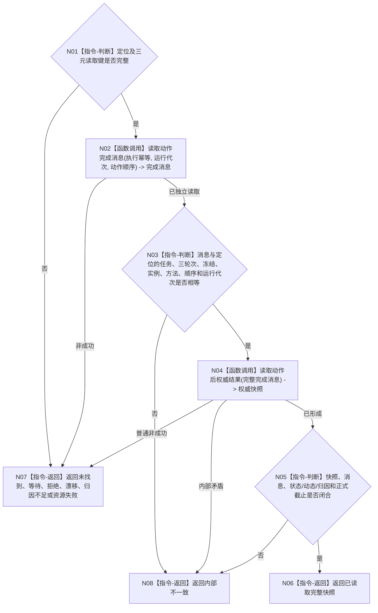

# BIZ-L4-004-08-02-01 读取动作完成消息与动作后权威结果目标函数流程图 v0.1

更新时间：2026-08-26

## 依据

```text
0050、5090 v0.8、5230、8100 v0.8
BIZ-L3-004-08-02；BIZ-L4-004-07-08-01—02
```

## 身份与边界

正式目标函数设计图。按 `{执行幂等身份, 运行代次, 动作顺序}` 精确读取首次完整动作完成消息，逐字段绑定工作定位，再调用动作后权威结果 provider读取正式状态、动态、场景、主体和归因快照。只读，不发布任务结果。

## 函数合同

```text
根函数：任务动作权威结果读回提供者::按工作定位读取动作后权威结果
归属模块 / 文件 / 目标分解深度：任务动作权威结果读回 / 海中鱼巣/领域/组合.任务动作权威结果读回.ixx / BIZ-L4
现有或待新增：适配现有完成消息端口 + `读取动作后权威结果`
完整签名：工作定位权威结果读取结果 任务动作权威结果读回提供者::按工作定位读取动作后权威结果(const 任务工作结果定位& 定位) const noexcept
参数：完整任务工作结果定位
返回结果：已读取、未找到、合法等待、入口/许可拒绝、当前性漂移、归因不足、资源失败或内部不一致；成功携带完整消息、快照和正式截止
被调函数流程图：复用 BIZ-L4-004-07-08-02；权威状态/动态读取在现有 provider 内组合
父图：BIZ-L3-004-08-02
```

## 流程图



## 关键边界

- 不同运行代次是不同消息账项；错误代次返回未找到，不跨代次命中。
- 完成消息和定位只作读取键/互证材料，不能补造权威状态或动态。
- 归因不足保留真实状态，但不能形成成功快照。
