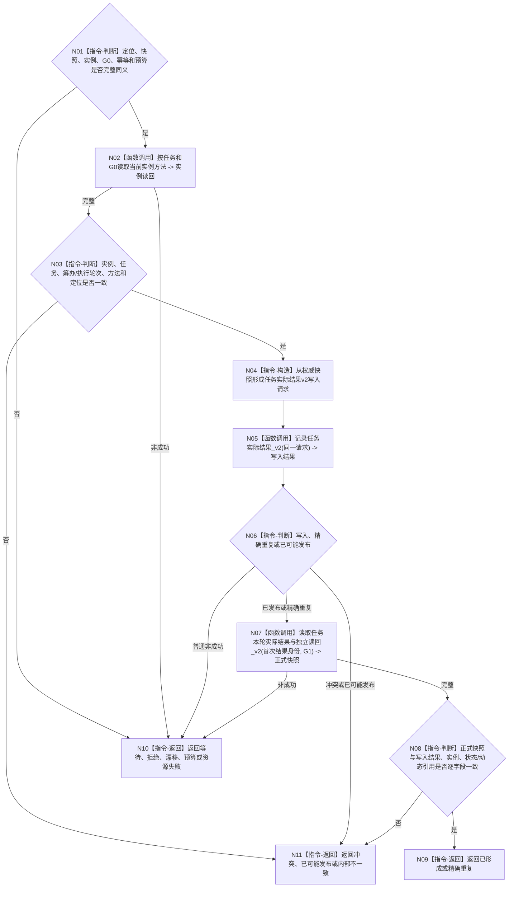

# BIZ-L4-004-08-02-02 发布并独立读回正式任务实际结果目标函数流程图 v0.1

更新时间：2026-08-26

## 依据

```text
0050、4260 v0.11、5090 v0.8、8100 v0.8
BIZ-L3-004-08-02、BIZ-L4-004-08-02-01
```

## 身份与边界

正式目标函数设计图。以完整动作后权威快照、当前实例方法和执行定位构造 task owner v2 请求，发布或精确重放正式任务实际结果，再以同一截止独立读回任务、实例、结果、状态和动态引用。只形成结果，不收束轮次。

## 函数合同

```text
根函数：任务实际结果上行桥::发布并独立读回正式任务实际结果
归属模块 / 文件 / 目标分解深度：任务实际结果上行桥 / 海中鱼巣/线程/上行桥.任务实际结果.ixx / BIZ-L4
现有或待新增：现有相邻实现可适配
完整签名：任务正式结果发布读回结果 任务实际结果上行桥::发布并独立读回正式任务实际结果(const 任务正式结果发布读回请求& 请求) noexcept
参数：定位、完整消息/快照、当前实例方法、G0、L2结构幂等身份和数量预算
返回结果：已形成、精确重复、合法等待、入口/许可拒绝、当前性漂移、数量预算不足、引用/幂等冲突、资源失败、已可能发布或内部不一致
被调函数流程图：task owner `记录任务实际结果_v2`；运行期只读查询 `读取任务本轮实际结果与独立读回_v2`
父图：BIZ-L3-004-08-02
```

## 流程图



## 关键边界

- task owner结果正文只引用权威状态/动态，不复制目标比较、需求满足或结果容量。
- `已可能发布`只返回提交见证并同键收敛，不能用第二幂等身份再写。
- 当前上行桥的 `最大来源需求成员数` 仅服务旧独立读回预算；目标迁移后不得据此遍历/分配/结算全部 `T→D`。
