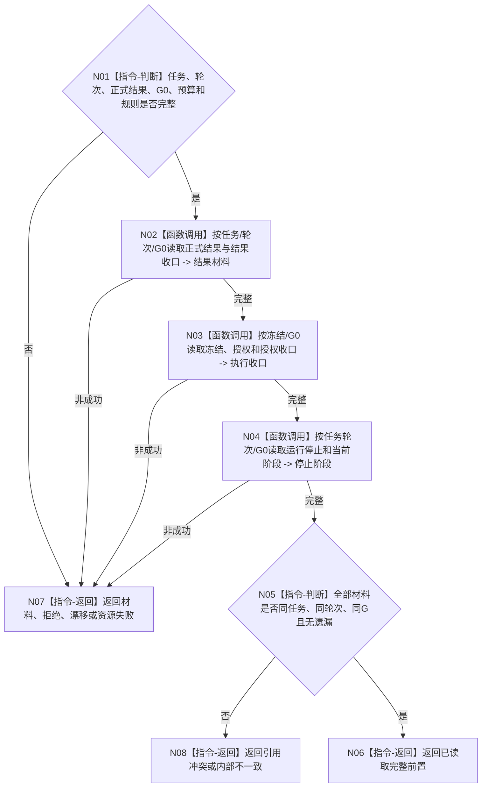

# BIZ-L4-004-08-03-01 读取任务轮次收束正式前置目标函数流程图 v0.1

更新时间：2026-08-26

## 依据

```text
0050、4260 v0.11、5090 v0.8、5160 v0.5、8100 v0.8
BIZ-L3-004-08-03
```

## 身份与边界

正式目标函数设计图。以任务和当前轮次为唯一范围，同截止读取正式任务实际结果、验证/归因收口、执行冻结收口、可选授权及其收口、运行停止证据和当前任务阶段；不读取消费分配、需求核算、价值或学习结果作为轮次收束前置。

## 函数合同

```text
根函数：任务轮次收束提供者::读取任务轮次收束正式前置
归属模块 / 文件 / 目标分解深度：任务轮次收束 / 海中鱼巣/领域/内部治理/服务.任务结果消费分配与轮次结算.ixx（待改名） / BIZ-L4
现有或待新增：迁移现有同截止材料组合器
完整签名：任务轮次收束前置读取结果 任务轮次收束提供者::读取任务轮次收束正式前置(const 任务轮次收束前置读取请求& 请求) const noexcept
参数：任务、任务轮次、正式结果、G0、各读取预算和规则版本
返回结果：已读取、材料不足、入口/许可拒绝、当前性/版本漂移、引用冲突、资源失败或内部不一致；成功携带完整前置和G0
被调函数流程图：复用各正式 owner 指定截止读取
父图：BIZ-L3-004-08-03
```

## 流程图



## 关键边界

`T→D` 的0/N关系组、需求核算组、结果消费分配、普通价值和学习变化都不属于本轮收束必需前置；它们有自己的 owner 和时序。
