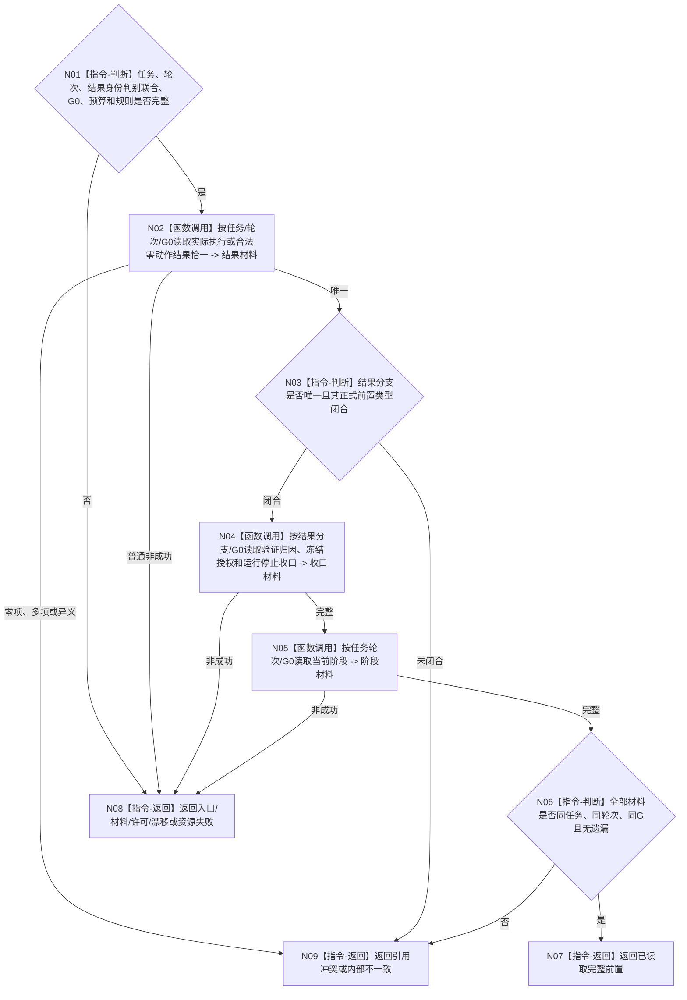

# BIZ-L4-004-08-03-01 读取任务轮次收束正式前置目标函数流程图 v0.2

更新时间：2026-08-27

## 依据与替代

```text
0050、3200、4260 v0.9、5090 v0.7、5210 v1.1、8100 v0.7
BIZ-L3-004-08-03 v0.2
```

本图完整替代 v0.1。前置读取以强类型判别联合读取“正式任务实际结果 / 合法无执行短路结果”恰一分支，不再把正式结果等同于必然发生过方法动作。

## 身份与边界

正式目标函数设计图。以任务和当前轮次为唯一范围，在同一非零 `G0` 读取唯一结果分支、该分支所需的验证 / 归因适用性收口、执行冻结与授权收口、运行停止证据和当前任务阶段；不读取结果分配、需求核算、价值或学习结果作为轮次收束前置。

## 函数合同

```text
根函数：任务轮次收束提供者::读取任务轮次收束正式前置
归属模块 / 文件 / 目标分解深度：任务轮次收束 / 海中鱼巣/领域/内部治理/服务.任务结果消费分配与轮次结算.ixx（待改名） / BIZ-L4
现有或待新增：迁移现有同截止材料组合器；增加结果判别联合
完整签名：任务轮次收束前置读取结果 任务轮次收束提供者::读取任务轮次收束正式前置(const 任务轮次收束前置读取请求& 请求) const noexcept
参数：任务、任务轮次、正式任务实际结果身份或合法无执行短路结果身份恰一、G0、各读取预算和规则版本
返回结果：已读取、材料不足、入口/许可拒绝、当前性/版本漂移、引用冲突、资源失败或内部不一致；成功携带唯一结果分支、完整前置和G0
被调函数流程图：复用各正式owner指定截止读取
父图：BIZ-L3-004-08-03 v0.2
```

## 流程图



## 关键边界

- 实际执行分支必须读取完成消息验真和权威动作后结果；合法零动作分支必须读取正式未执行证明，二者不能互相补位。
- `T→D` 的0/N关系组、需求核算组、结果消费分配、普通价值和学习变化都不属于本轮收束必需前置。
