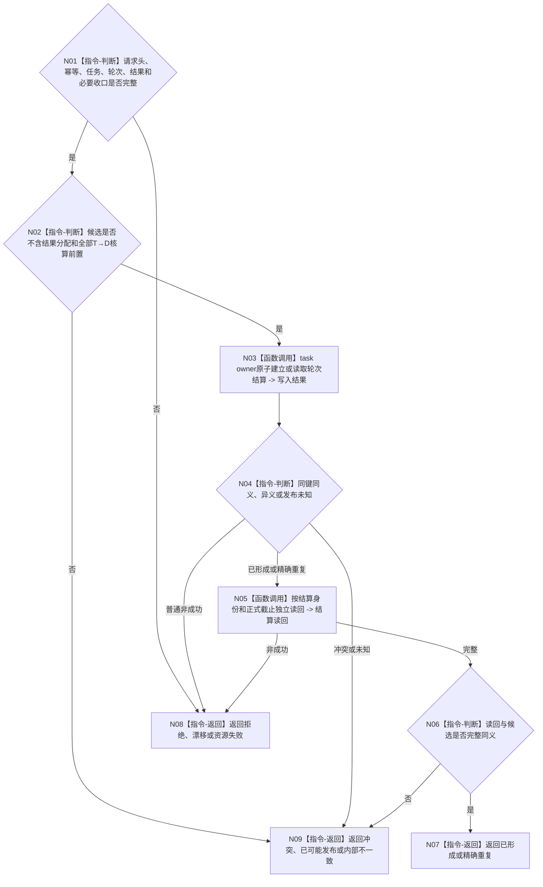

# BIZ-L4-004-08-03-02 建立或读取任务轮次结算目标函数流程图 v0.1

更新时间：2026-08-26

## 依据

```text
0050、4260 v0.11、5090 v0.8、5160 v0.5
BIZ-L3-004-08-03、BIZ-L4-004-08-03-01
```

## 身份与边界

正式目标函数设计图。以完整收束前置建立或读取本任务轮次唯一结算事实。结算只引用本轮正式结果和必要收口，不保存结果分配或全部需求核算组。

## 函数合同

```text
根函数：L2任务结构服务::建立或读取任务轮次结算
归属模块 / 文件 / 目标分解深度：任务结构 owner / 海中鱼巣/领域/服务.L2任务结构.ixx / BIZ-L4
现有或待新增：现有ABI需按5090 v0.8/5160 v0.5迁移旧必填字段
完整签名：L2任务轮次结算结果 L2任务结构服务::建立或读取任务轮次结算(const L2任务轮次结算请求& 请求) noexcept
参数：结构合同、请求头、幂等身份和不含结果分配/T→D核算的完整候选事实
返回结果：已形成、精确重复、入口/许可拒绝、当前性漂移、引用/幂等冲突、资源失败、已可能发布或内部不一致
被调函数流程图：无；owner事务内部不在BIZ继续拆分
父图：BIZ-L3-004-08-03
```

## 流程图



## 关键边界

当前工作区结算事实仍含消费分配记录、需求核算、价值和学习字段；它们必须从生产成功公式退出后，本图才可声明实现。
