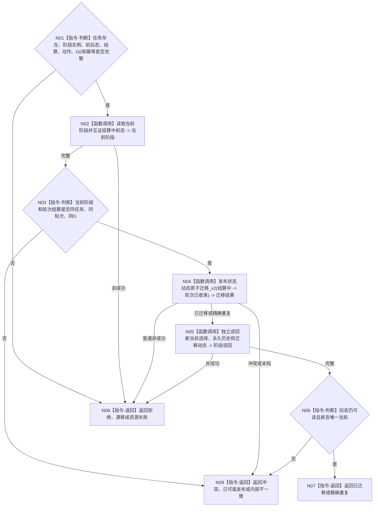

# BIZ-L4-004-08-03-03 发布并读回轮次已收束阶段迁移目标函数流程图 v0.1

更新时间：2026-08-26

## 依据

```text
0050、1160、4260 v0.11、5090 v0.8、8100 v0.8
BIZ-L3-004-08-03、BIZ-L4-004-08-03-02
```

## 身份与边界

正式目标函数设计图。在轮次结算正式读回后，以具名轮次收束治理动作把任务阶段从结算中迁移到轮次已收束，并独立读回状态、当前选择和动态。状态历史永久保留；不建立新轮次。

## 函数合同

```text
根函数：任务阶段结构消费端口::发布并读回轮次已收束阶段迁移
归属模块 / 文件 / 目标分解深度：任务阶段结构消费 / 海中鱼巣/领域/内部治理/服务.任务阶段结构消费端口.ixx / BIZ-L4
现有或待新增：适配现有阶段迁移端口
完整签名：任务阶段迁移结果 任务阶段结构消费端口::发布并读回轮次已收束阶段迁移(const 任务阶段迁移请求& 请求) noexcept
参数：正式任务存在/阶段实例、结算中前态、轮次已收束后态、轮次结算、治理动作、G0、幂等和时间
返回结果：已迁移、精确重复、入口/许可拒绝、当前性漂移、引用/幂等冲突、资源失败、已可能发布或内部不一致
被调函数流程图：复用ARCH-L2状态动态原子迁移公开ABI
父图：BIZ-L3-004-08-03
```

## 流程图



## 关键边界

轮次已收束只表示本轮关闭并等待self后继决议；不得自动迁移到筹办中或复用旧冻结、实例和授权。
