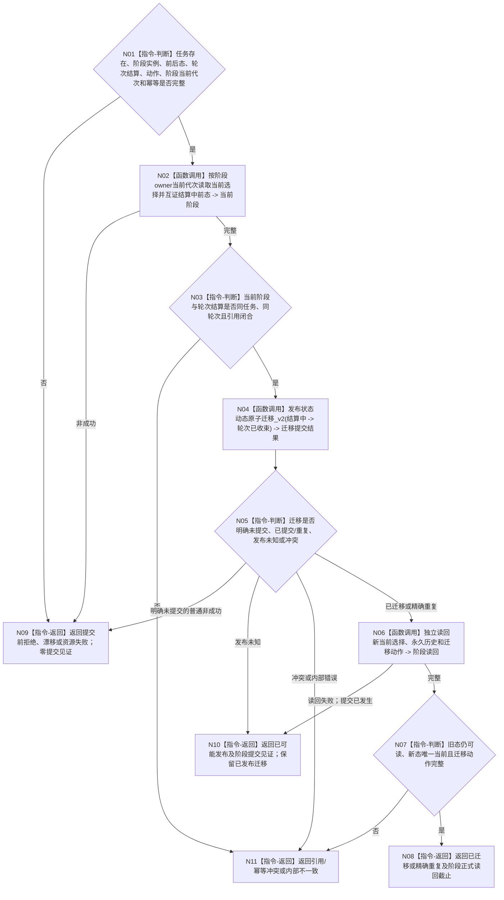

# BIZ-L4-004-08-03-03 发布并读回轮次已收束阶段迁移目标函数流程图 v0.2

更新时间：2026-08-27

## 依据与替代

```text
0050、1160、4260、5090、8100
BIZ-L3-004-08-03 v0.3、BIZ-L4-004-08-03-02 v0.2
```

本图完整替代 v0.1。v0.1 在原子迁移提交后读回失败时仍落入普通资源失败，可能把已经发布的阶段迁移伪装成零写；v0.2 固定返回 `已可能发布 + 阶段提交见证`，并要求原幂等身份重放收敛。

## 身份与边界

正式目标函数设计图。在轮次结算正式读回后，以具名轮次收束治理动作把任务阶段从结算中迁移到轮次已收束，并独立读回状态、当前选择和动态。状态历史永久保留；不建立新轮次。阶段 owner 的写入当前代次和正式读回截止独立于 task owner 的轮次结算截止。

## 函数合同

```text
根函数：任务阶段结构消费端口::发布并读回轮次已收束阶段迁移
归属模块 / 文件 / 目标分解深度：任务阶段结构消费 / 海中鱼巣/领域/内部治理/服务.任务阶段结构消费端口.ixx / BIZ-L4
现有或待新增：适配现有阶段迁移端口
完整签名：任务阶段迁移结果 任务阶段结构消费端口::发布并读回轮次已收束阶段迁移(const 任务阶段迁移请求& 请求) noexcept
参数：正式任务存在/阶段实例、结算中前态、轮次已收束后态、轮次结算身份与正式引用、治理动作、阶段owner紧邻写入当前代次、幂等和时间
返回结果：已迁移、精确重复、入口/许可拒绝、当前性漂移、引用/幂等冲突、资源失败、已可能发布或内部不一致；成功携带迁移事实和阶段正式读回截止，已可能发布携带阶段提交见证
被调函数流程图：复用ARCH-L2状态动态原子迁移公开ABI
父图：BIZ-L3-004-08-03 v0.3
```

## 流程图



## 关键边界

- 只有提交前且 owner 明确证明零提交的拒绝、漂移或资源失败才能返回普通非成功。
- 原子迁移确认、精确重复确认或发布未知之后，独立读回失败统一返回 `已可能发布 + 阶段提交见证`；不得返回暗示零写的普通资源失败。
- 恢复只能使用原阶段迁移幂等身份和原完整请求；换键补发属于冲突风险。
- 阶段迁移失败或读回未知不得回滚已正式发布的任务轮次结算；轮次已收束只表示本轮关闭并等待 self 后继决议，不自动建立下一轮。
