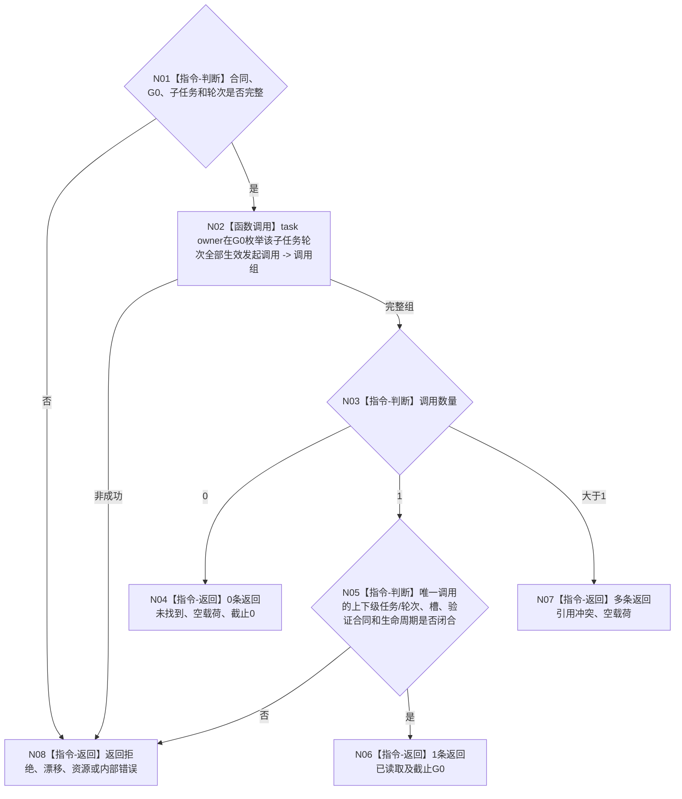

# BIZ-L4-004-08-04-01 按子任务轮次读取发起调用目标函数流程图 v0.1

更新时间：2026-08-26

## 依据

```text
0050、4260 v0.11 第12.5节、5090 v0.8、5160 v0.5
BIZ-L3-004-08-04 v0.2
```

## 身份与边界

正式目标函数设计图。只按子任务与已收束子任务轮次在指定 `G0` 读取轮次级发起调用。0条返回未找到并由父图解释为根任务；1条返回完整强类型调用；多条返回引用冲突。不得从其它关系猜测调用。

## 函数合同

```text
根函数：L2任务结构服务::按子任务轮次读取发起调用_v1
归属模块 / 文件 / 目标分解深度：任务结构 owner / 海中鱼巣/领域/服务.L2任务结构.ixx / BIZ-L4
现有或待新增：4260已冻结；发布源码尚无生产ABI，目标待实现/接线
完整签名：L2按子任务轮次读取发起调用结果_v1 L2任务结构服务::按子任务轮次读取发起调用_v1(const L2按子任务轮次读取发起调用请求_v1& 请求) const noexcept
参数：合同版本、L2请求头(G0)、子任务、子任务轮次
返回结果：已读取、未找到、入口/许可拒绝、当前性漂移、引用冲突、资源失败或内部错误；成功截止=G0
被调函数流程图：无；owner内部读取
父图：BIZ-L3-004-08-04 v0.2
```

## 流程图



## 关键边界

`T→D`、需求树父子、查询锚点、任务创建者和线程队列均不是调用来源。
