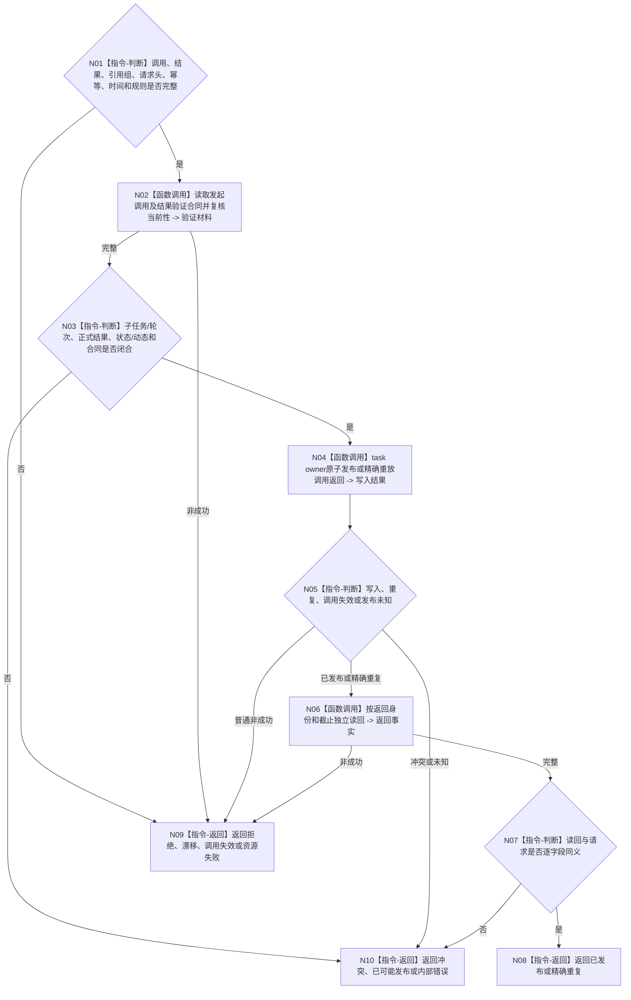

# BIZ-L4-004-08-04-02 发布或读取任务轮次调用返回目标函数流程图 v0.1

更新时间：2026-08-26

## 依据

```text
0050、4260 v0.11 第12.6节、5090 v0.8、5160 v0.5
BIZ-L3-004-08-04、BIZ-L4-004-08-04-01
```

## 身份与边界

正式目标函数设计图。按唯一发起调用和结果验证合同，把子任务正式结果及规范有序状态/动态引用组发布为调用返回并独立读回。返回只交付结果，不写上级目标或需求满足。

## 函数合同

```text
根函数：L2任务结构服务::发布或读取任务轮次调用返回_v1
归属模块 / 文件 / 目标分解深度：任务结构 owner / 海中鱼巣/领域/服务.L2任务结构.ixx / BIZ-L4
现有或待新增：4260已冻结，当前工作区生产ABI待实现/接线
完整签名：L2发布任务轮次调用返回结果_v1 L2任务结构服务::发布或读取任务轮次调用返回_v1(const L2发布任务轮次调用返回请求_v1& 请求) noexcept
参数：合同、L2请求头、幂等身份、发起调用、子任务结果、状态/动态引用组、发生时间和规则版本
返回结果：已发布、精确重复、入口/许可拒绝、当前性漂移、调用失效、引用/幂等冲突、资源失败、已可能发布或内部错误
被调函数流程图：无；owner内部事务和读回
父图：BIZ-L3-004-08-04
```

## 流程图



## 关键边界

调用返回重试不得重新执行子任务动作；父轮次已取消、换轮或槽失效时只返回调用失效/漂移。
