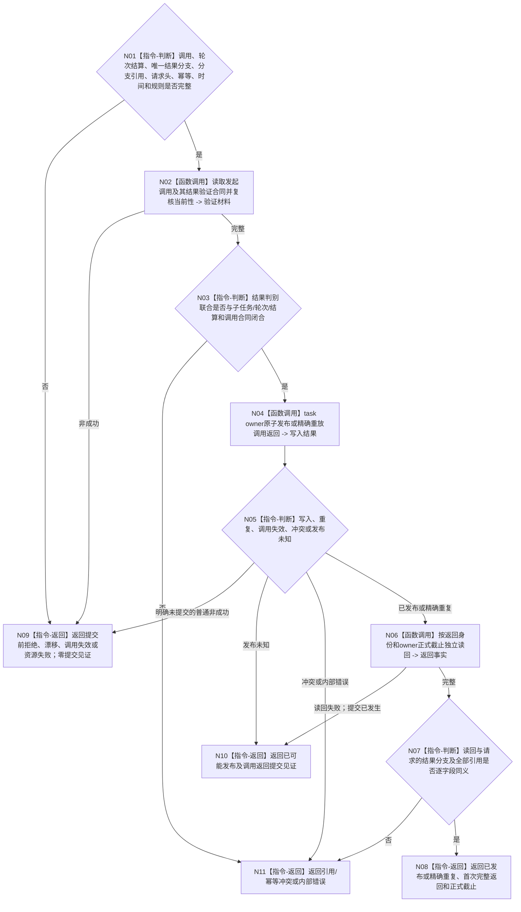

# BIZ-L4-004-08-04-02 发布或读取任务轮次调用返回目标函数流程图 v0.2

更新时间：2026-08-27

## 依据与替代

```text
0050、4260、5090、5160
BIZ-L3-004-08-04 v0.2、BIZ-L4-004-08-04-01 v0.1
```

本图完整替代 v0.1。v0.1 只接受子任务正式实际结果，无法承载合法无执行短路；并把提交后的独立读回失败落入普通资源失败。v0.2 接受结果判别联合，且提交后读回失败固定返回 `已可能发布 + 调用返回提交见证`。

## 身份与边界

正式目标函数设计图。按唯一发起调用和调用冻结的结果验证合同，把子任务本轮唯一正式结果分支发布为调用返回并独立读回。任务实际结果分支携带规范有序状态 / 动态引用组；合法无执行短路分支要求该组为空。返回只保存强类型引用，不复制结果正文，不写上级目标或需求满足。

## 函数合同

```text
根函数：L2任务结构服务::发布或读取任务轮次调用返回_v2
归属模块 / 文件 / 目标分解深度：任务结构 owner / 海中鱼巣/领域/服务.L2任务结构.ixx / BIZ-L4
现有或待新增：现有v1目标合同需升级结果判别联合；HEAD生产ABI待实现/接线
完整签名：L2发布任务轮次调用返回结果_v2 L2任务结构服务::发布或读取任务轮次调用返回_v2(const L2发布任务轮次调用返回请求_v2& 请求) noexcept
参数：合同、L2请求头、幂等身份、发起调用、轮次结算、正式任务实际结果或合法无执行短路结果恰一、分支对应引用组、发生时间和规则版本
返回结果：已发布、精确重复、入口/许可拒绝、当前性漂移、调用失效、引用/幂等冲突、资源失败、已可能发布或内部错误；成功携带首次完整调用返回和本次正式读回截止，已可能发布只携带调用返回提交见证
被调函数流程图：无；owner内部事务和读回
父图：BIZ-L3-004-08-04 v0.2
```

## 流程图



## 分支有效性

- 正式任务实际结果分支：实际结果身份非零，状态 / 动态引用组满足调用冻结的结果验证合同，短路结果身份为空。
- 合法无执行短路分支：短路结果身份、fresh 已满足和正式未执行引用完整，状态 / 动态引用组及实际结果身份为空。
- 两分支同时存在、同时为空、引用跨轮次或同键换分支均为引用 / 幂等冲突。

## 关键边界

- 调用返回重试不得重新执行子任务动作或重新裁决零动作；只能使用原幂等身份和原完整请求。
- 父轮次已取消、换轮或槽失效时只返回调用失效 / 漂移。
- 提交后读回失败不得退化为普通资源失败；调用返回可能已经存在，必须以原键和提交见证收敛。
