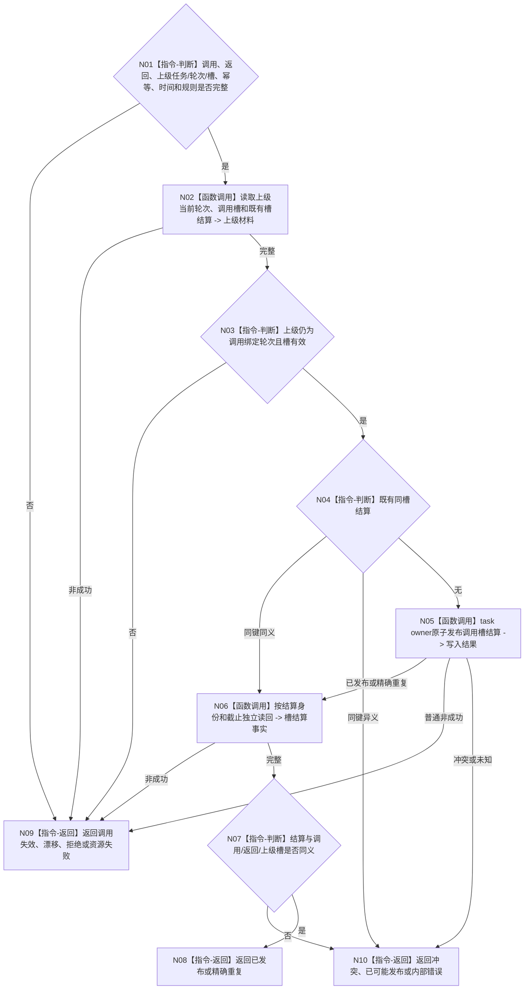

# BIZ-L4-004-08-04-03 结算或读取任务轮次上级调用槽目标函数流程图 v0.1

更新时间：2026-08-26

## 依据

```text
0050、4260 v0.11 第12.6节、5090 v0.8、5160 v0.5
BIZ-L3-004-08-04、BIZ-L4-004-08-04-02
```

## 身份与边界

正式目标函数设计图。调用返回正式读回后，由 task owner 在发起调用绑定的上级任务轮次和调用槽仍有效时，幂等发布或读取调用槽结算。只把槽标记为已返回，不迁移上级任务阶段，不判断上级目标。

## 函数合同

```text
根函数：L2任务结构服务::结算或读取任务轮次上级调用槽_v1
归属模块 / 文件 / 目标分解深度：任务结构 owner / 海中鱼巣/领域/服务.L2任务结构.ixx / BIZ-L4
现有或待新增：4260已冻结，当前工作区生产ABI待实现/接线
完整签名：L2结算任务轮次上级调用槽结果_v1 L2任务结构服务::结算或读取任务轮次上级调用槽_v1(const L2结算任务轮次上级调用槽请求_v1& 请求) noexcept
参数：合同、L2请求头、幂等身份、发起调用、调用返回、上级任务/轮次/槽、时间和规则
返回结果：已发布、精确重复、入口/许可拒绝、当前性漂移、调用失效、引用/幂等冲突、资源失败、已可能发布或内部错误
被调函数流程图：无；owner内部事务和读回
父图：BIZ-L3-004-08-04
```

## 流程图



## 关键边界

调用槽结算后只唤醒上级任务 fresh 重判自己的目标/方法条件；不得把返回结果或槽结算复制成上级需求满足。
