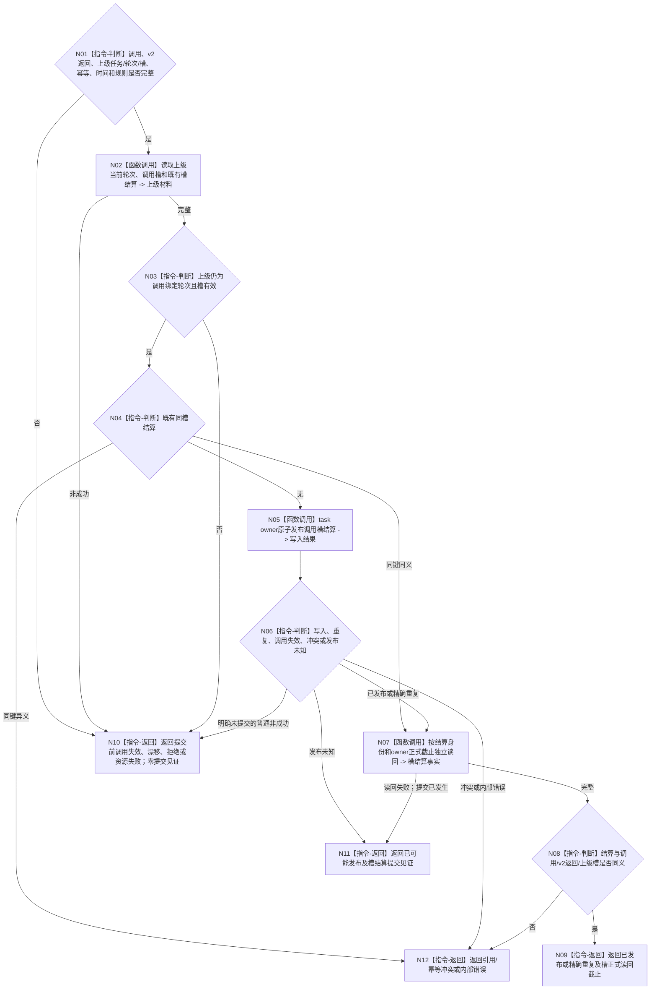

# BIZ-L4-004-08-04-03 结算或读取任务轮次上级调用槽目标函数流程图 v0.2

更新时间：2026-08-27

## 依据与替代

```text
0050、4260、5090、5160
BIZ-L3-004-08-04 v0.2、BIZ-L4-004-08-04-02 v0.2
```

本图完整替代 v0.1。v0.1 把调用槽结算提交后的读回失败落入普通资源失败；v0.2 固定返回 `已可能发布 + 调用槽结算提交见证`，并消费 v0.2 调用返回的结果判别联合而不解释结果正文。

## 身份与边界

正式目标函数设计图。调用返回正式读回后，由 task owner 在发起调用绑定的上级任务轮次和调用槽仍有效时，幂等发布或读取调用槽结算。它只把槽标记为已返回，不迁移上级任务阶段，不判断上级目标，也不区分调用返回源自实际执行还是合法零动作。

## 函数合同

```text
根函数：L2任务结构服务::结算或读取任务轮次上级调用槽_v2
归属模块 / 文件 / 目标分解深度：任务结构 owner / 海中鱼巣/领域/服务.L2任务结构.ixx / BIZ-L4
现有或待新增：现有v1目标合同需补齐发布后读回见证；发布源码生产ABI待实现/接线
完整签名：L2结算任务轮次上级调用槽结果_v2 L2任务结构服务::结算或读取任务轮次上级调用槽_v2(const L2结算任务轮次上级调用槽请求_v2& 请求) noexcept
参数：合同、L2请求头、幂等身份、发起调用、v2调用返回、上级任务/轮次/槽、时间和规则
返回结果：已发布、精确重复、入口/许可拒绝、当前性漂移、调用失效、引用/幂等冲突、资源失败、已可能发布或内部错误；成功携带首次完整槽结算和正式读回截止，已可能发布只携带槽结算提交见证
被调函数流程图：无；owner内部事务和读回
父图：BIZ-L3-004-08-04 v0.2
```

## 流程图



## 关键边界

- 调用槽结算后只唤醒上级任务 fresh 重判自己的目标 / 方法条件；不得把返回结果或槽结算复制成上级需求满足。
- 结算入口不解释 v2 调用返回的结果分支，只逐字段绑定其正式身份和截止。
- 提交后读回失败必须保留槽结算见证并原键恢复；不得撤销已经发布的调用返回或子任务轮次结算。
