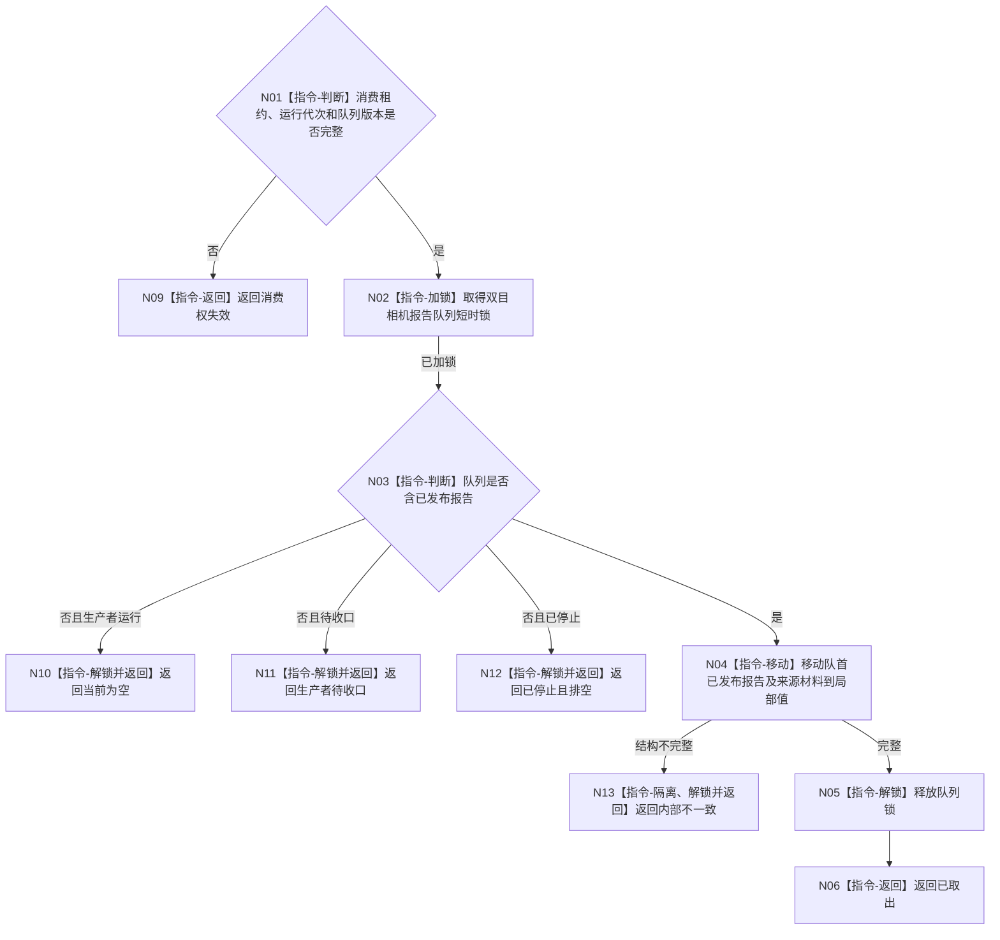

# BIZ-L4-004-09-02-01 双目相机报告队列尝试移动一个已发布报告目标函数流程图 v0.1

更新时间：2026-08-03

## 依据

```text
4050、6340、6350、8100；BIZ-L3-004-09-02
```

## 身份与边界

正式目标函数设计图。任务域独占消费者从双目相机单一物理报告队列短时移动一个已发布强类型报告；不验证产品、不形成承接事实。

## 函数合同

```text
根函数：双目相机报告队列::尝试移动一个已发布报告
归属模块 / 文件 / 层级：双目相机报告队列 / 海中鱼巣/外设/队列.双目相机报告.ixx / L4
现有或待新增：适配扩展；统一四类产品variant与任务域独占消费权
完整签名：双目相机报告取出结果 双目相机报告队列::尝试移动一个已发布报告() noexcept
参数：无；对象绑定运行代次、生产者停止见证、任务域唯一消费租约和单一物理队列
返回结果：值式结果；含已取出、当前为空、生产者待收口、已停止且排空、消费权失效或内部不一致，以及四类产品variant、报告身份、生产代次和队列版本
被调函数流程图：无；短时锁内队列移动为本函数内指令
父图：BIZ-L3-004-09-02
```

## 流程图



## 节点合同

| 节点 | 类型 | 输入 | 输出 | 事实读写 | 验证 |
| --- | --- | --- | --- | --- | --- |
| N02—N04 | 指令 | 独占消费租约 | 移动报告 | 队列项移动 | 候选零可见、短时锁 |
| N05/N06 | 指令 | 局部报告 | 取出结果 | 无业务写入 | 四类variant恰一 |

## 关键边界

四类产品共享一个物理报告队列但保留强类型身份；取出顺序不改变报告一次承接唯一性。
